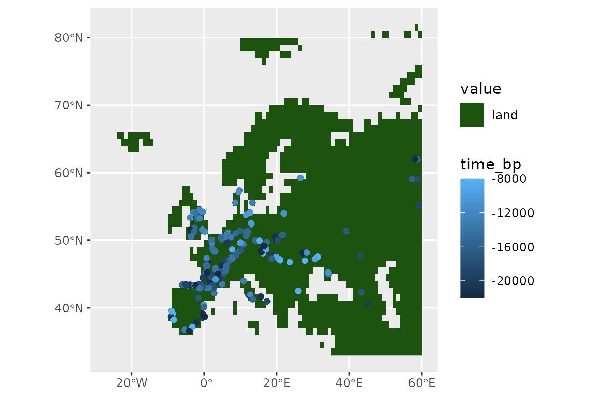
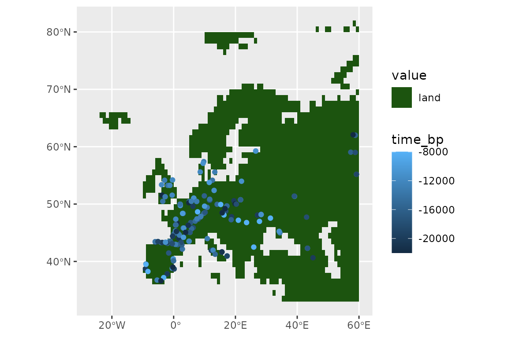
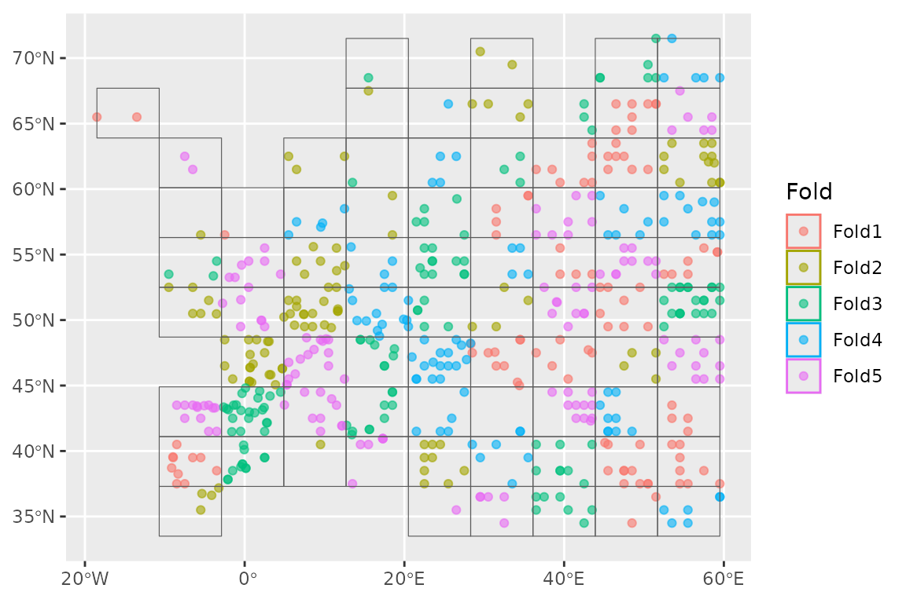
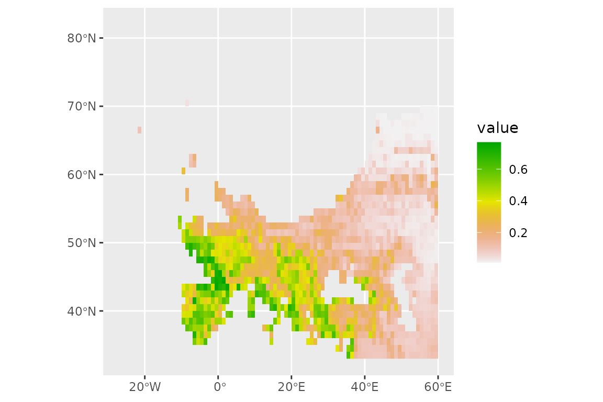

# Application with palaeodata

## SDMs with tidymodels for palaeo data

In this article, we show how a Species Distribution Model can be fitted
with `tidysdm` on time-scattered (i.e.palaeontological,
archaeozoological, archaeological) data, with samples covering different
time periods. We recommend users first read the “tidysdm overview”
article, which introduces a number of functions and concepts that will
be used in the present article.

We first load `tidysdm`:

``` r
library(tidysdm)
#> Loading required package: tidymodels
#> ── Attaching packages ────────────────────────────────────── tidymodels 1.4.1 ──
#> ✔ broom        1.0.11     ✔ recipes      1.3.1 
#> ✔ dials        1.4.2      ✔ rsample      1.3.1 
#> ✔ dplyr        1.1.4      ✔ tailor       0.1.0 
#> ✔ ggplot2      4.0.1      ✔ tidyr        1.3.1 
#> ✔ infer        1.0.9      ✔ tune         2.0.1 
#> ✔ modeldata    1.5.1      ✔ workflows    1.3.0 
#> ✔ parsnip      1.4.0      ✔ workflowsets 1.1.1 
#> ✔ purrr        1.2.0      ✔ yardstick    1.3.2
#> ── Conflicts ───────────────────────────────────────── tidymodels_conflicts() ──
#> ✖ purrr::discard() masks scales::discard()
#> ✖ dplyr::filter()  masks stats::filter()
#> ✖ dplyr::lag()     masks stats::lag()
#> ✖ recipes::step()  masks stats::step()
#> Loading required package: spatialsample
```

## Preparing your data

We start by loading a set of radiocarbon dates (calibrated) for horses,
covering from 22k years ago until 8k years ago.

``` r
data(horses)
horses
#> # A tibble: 788 × 3
#>    latitude longitude time_bp
#>       <dbl>     <dbl>   <int>
#>  1     43.2     -2.04  -14000
#>  2     43.2     -2.04  -14000
#>  3     43.2     -2.04  -14000
#>  4     43.2     -2.04  -14000
#>  5     43.2     -2.04  -16000
#>  6     43.3     -1.89  -16000
#>  7     43.2     -2.2   -14000
#>  8     43.2     -2.2   -19000
#>  9     43.2     -2.2   -20000
#> 10     43.2     -2.2   -21000
#> # ℹ 778 more rows
```

We convert our dataset into an `sf` data.frame so that we can easily
plot it (here `tidyterra` shines):

``` r
library(sf)
#> Linking to GEOS 3.12.1, GDAL 3.8.4, PROJ 9.4.0; sf_use_s2() is TRUE
horses <- st_as_sf(horses, coords = c("longitude", "latitude"))
st_crs(horses) <- 4326
```

As a background to our presences, we will use the land mask for the
present, taken from `pastclim`, and cut to cover only Europe:

    #> Loading required package: terra
    #> terra 1.8.86
    #> 
    #> Attaching package: 'terra'
    #> The following object is masked from 'package:tidyr':
    #> 
    #>     extract
    #> The following object is masked from 'package:dials':
    #> 
    #>     buffer
    #> The following object is masked from 'package:scales':
    #> 
    #>     rescale

``` r
library(pastclim)
land_mask <- pastclim::get_land_mask(time_bp = 0, dataset = "Example")
europe_poly <- vect(region_outline$Europe)
crs(europe_poly) <- "lonlat"
land_mask <- crop(land_mask, europe_poly)
land_mask <- mask(land_mask, europe_poly)
```

And use `tidyterra` to plot:

``` r
library(tidyterra)
#> 
#> Attaching package: 'tidyterra'
#> The following object is masked from 'package:stats':
#> 
#>     filter
ggplot() +
  geom_spatraster(data = land_mask, aes(fill = land_mask_0)) +
  geom_sf(data = horses, aes(col = time_bp))
```



We now thin our presences, so that locations are further than 100km and
2000 years apart.

``` r
set.seed(123)
horses <- thin_by_dist_time(horses,
  dist_min = km2m(100),
  interval_min = y2d(2000),
  time_col = "time_bp",
  lubridate_fun = pastclim::ybp2date
)
nrow(horses)
#> [1] 185
```

And see what we have left:

``` r
ggplot() +
  geom_spatraster(data = land_mask, aes(fill = land_mask_0)) +
  geom_sf(data = horses, aes(col = time_bp))
```



We now need a time series of palaeoclimate reconstructions. In this
vignette, we will use the example dataset from `pastclim`. This dataset
only has reconstructions every 5k years for the past 20k years at 1
degree resolution, with 3 bioclimatic variables. It will suffice for
illustrative purposes, but we recommend that you download higher quality
datasets with `pastclim` for real analysis. As for the land mask, we
will cut the reconstructions to cover Europe only:

``` r
library(pastclim)
climate_vars <- c("bio01", "bio10", "bio12")
climate_full <- pastclim::region_series(
  bio_variables = climate_vars,
  data = "Example",
  crop = region_outline$Europe
)
```

Now we thin the observations to only keep one per cell in the raster (it
would be better if we had an equal area projection…), and remove
locations outside the desired area (if there was any):

``` r
set.seed(123)
horses <- thin_by_cell_time(horses,
  raster = climate_full,
  time_col = "time_bp",
  lubridate_fun = pastclim::ybp2date
)
nrow(horses)
#> [1] 138
```

Let’s see what we have left of our points:

``` r
ggplot() +
  geom_spatraster(data = land_mask, aes(fill = land_mask_0)) +
  geom_sf(data = horses, aes(col = time_bp))
```


Now we sample pseudo-absences (we will constraint them to be at least
70km away from any presences), selecting three times the number of
presences

``` r
set.seed(123)
horses <- sample_pseudoabs_time(horses,
  n_per_presence = 3,
  raster = climate_full,
  time_col = "time_bp",
  lubridate_fun = pastclim::ybp2date,
  method = c("dist_min", km2m(70))
)
```

Let’s see our presences and absences:

``` r
ggplot() +
  geom_spatraster(data = land_mask, aes(fill = land_mask_0)) +
  geom_sf(data = horses, aes(col = class))
```


Now let’s get the climate for these location. `pastclim` requires a data
frame with two columns with coordinates and a column of time in years
before present (where negative values represent time in the past). We
manipulate the `sf` object accordingly:

``` r
horses_df <- horses %>%
  dplyr::bind_cols(sf::st_coordinates(horses)) %>%
  mutate(time_bp = date2ybp(time_step)) %>%
  as.data.frame() %>%
  select(-geometry)
# get climate
horses_df <- location_slice_from_region_series(horses_df,
  region_series = climate_full
)

# add the climate reconstructions to the sf object, and remove the time_step
# as we don't need it for modelling
horses <- horses %>%
  bind_cols(horses_df[, climate_vars]) %>%
  select(-time_step)
```

## Fit the model by crossvalidation

Next, we need to set up a `recipe` to define how to handle our dataset.
We don’t want to transform our data, so we just need to define the
formula (*class* is the outcome, all other variables are predictors;
note that, for `sf` objects, `geometry` is automatically ignored as a
predictor):

``` r
horses_rec <- recipe(horses, formula = class ~ .)
horses_rec
#> 
#> ── Recipe ──────────────────────────────────────────────────────────────────────
#> 
#> ── Inputs
#> Number of variables by role
#> outcome:   1
#> predictor: 3
#> coords:    2
```

We can quickly check that we have the variables that we want with:

``` r
horses_rec$var_info
#> # A tibble: 6 × 4
#>   variable type      role      source  
#>   <chr>    <list>    <chr>     <chr>   
#> 1 bio01    <chr [2]> predictor original
#> 2 bio10    <chr [2]> predictor original
#> 3 bio12    <chr [2]> predictor original
#> 4 X        <chr [2]> coords    original
#> 5 Y        <chr [2]> coords    original
#> 6 class    <chr [3]> outcome   original
```

We now build a `workflow_set` of different models, defining which
hyperparameters we want to tune. We will use *glm*, *gam*, *random
forest* and *boosted trees* as our models, so only *random forest* and
*boosted trees* have tunable hyperparameters. For the most commonly used
models, `tidysdm` automatically chooses the most important parameters,
but it is possible to fully customise model specifications.

``` r
horses_models <-
  # create the workflow_set
  workflow_set(
    preproc = list(default = horses_rec),
    models = list(
      # the standard glm specs  (no params to tune)
      glm = sdm_spec_glm(),
      # the standard sdm specs (no params to tune)
      gam = sdm_spec_gam(),
      # rf specs with tuning
      rf = sdm_spec_rf(),
      # boosted tree model (gbm) specs with tuning
      gbm = sdm_spec_boost_tree()
    ),
    # make all combinations of preproc and models,
    cross = TRUE
  ) %>%
  # set formula for gams
  update_workflow_model("default_gam",
    spec = sdm_spec_gam(),
    formula = gam_formula(horses_rec)
  ) %>%
  # tweak controls to store information needed later to create the ensemble
  option_add(control = control_ensemble_grid())
```

Note that *gams* are unusual, as we need to specify a formula to define
to which variables we will fit smooths. By default,
[`gam_formula()`](https://evolecolgroup.github.io/tidysdm/reference/gam_formula.md)
fits a smooth to every continuous predictor, but a custom formula can be
provided instead.

We now want to set up a spatial block cross-validation scheme to tune
and assess our models:

``` r
library(tidysdm)
set.seed(1005)
horses_cv <- spatial_block_cv(horses, v = 5)
autoplot(horses_cv)
```



We can now use the block CV folds to tune and assess the models:

``` r
set.seed(123)
horses_models <-
  horses_models %>%
  workflow_map("tune_grid",
    resamples = horses_cv, grid = 5,
    metrics = sdm_metric_set(), verbose = TRUE
  )
#> i  No tuning parameters. `fit_resamples()` will be attempted
#> i 1 of 4 resampling: default_glm
#> ✔ 1 of 4 resampling: default_glm (475ms)
#> i  No tuning parameters. `fit_resamples()` will be attempted
#> i 2 of 4 resampling: default_gam
#> ✔ 2 of 4 resampling: default_gam (686ms)
#> i 3 of 4 tuning:     default_rf
#> i Creating pre-processing data to finalize 1 unknown parameter: "mtry"
#> ✔ 3 of 4 tuning:     default_rf (2.9s)
#> i 4 of 4 tuning:     default_gbm
#> i Creating pre-processing data to finalize 1 unknown parameter: "mtry"
#> → A | warning: `early_stop` was reduced to 0.
#> There were issues with some computations   A: x1
#> There were issues with some computations   A: x2
#> There were issues with some computations   A: x3
#> There were issues with some computations   A: x5
#> There were issues with some computations   A: x5
#> 
#> ✔ 4 of 4 tuning:     default_gbm (11.4s)
```

Note that `workflow_set` correctly detects that we have no tuning
parameters for *glm* and *gam*. We can have a look at the performance of
our models with:

``` r
autoplot(horses_models)
```


Now let’s create an ensemble, selecting the best set of parameters for
each model (this is really only relevant for the random forest, as there
were not hype-parameters to tune for the glm and gam). We will use the
Boyce continuous index as our metric to choose the best random forest
and boosted tree. When adding members to an ensemble, they are
automatically fitted to the full training dataset, and so ready to make
predictions.

``` r
horses_ensemble <- simple_ensemble() %>%
  add_member(horses_models, metric = "boyce_cont")
```

And visualise it

``` r
autoplot(horses_ensemble)
```


## Projecting to other times

We can now make predictions with this ensemble (using the default option
of taking the mean of the predictions from each model) for the Last
Glacial Maximum (LGM, 21,000 years ago).

``` r
climate_lgm <- pastclim::region_slice(
  time_bp = -20000,
  bio_variables = climate_vars,
  data = "Example",
  crop = region_outline$Europe
)
```

And predict using the ensemble:

``` r
prediction_lgm <- predict_raster(horses_ensemble, climate_lgm)
ggplot() +
  geom_spatraster(data = prediction_lgm, aes(fill = mean)) +
  scale_fill_terrain_c()
```


