# Examples of additional tidymodels features

In this vignette, we illustrate how a number of features from
`tidymodels` can be used to enhance a conventional SDM pipeline. If
you’re new to `tidymodels`; there are a number of excellent tutorials
(both introductory and advanced) on its dedicated
[website](https://www.tidymodels.org/). We reuse the example on the
Iberian lizard from the [`tidysdm`
overview](https://evolecolgroup.github.io/tidysdm/articles/a0_tidysdm_overview.html)
article. Subsection are written to be self-contained, so you can read
and run them independently.

## Using multi-level factors as predictors

Most machine learning algorithms do not natively use multilevel factors
as predictors. The solution is to create dummy variables, which are
binary variables that represent the levels of the factor. In
`tidymodels`, this is done using the `step_dummy` function.

Let’s create a factor variable with 3 levels based on altitude.

``` r
library(tidysdm)
#> Loading required package: tidymodels
#> ── Attaching packages ────────────────────────────────────── tidymodels 1.4.1 ──
#> ✔ broom        1.0.12     ✔ recipes      1.3.1 
#> ✔ dials        1.4.2      ✔ rsample      1.3.2 
#> ✔ dplyr        1.2.0      ✔ tailor       0.1.0 
#> ✔ ggplot2      4.0.2      ✔ tidyr        1.3.2 
#> ✔ infer        1.1.0      ✔ tune         2.0.1 
#> ✔ modeldata    1.5.1      ✔ workflows    1.3.0 
#> ✔ parsnip      1.4.1      ✔ workflowsets 1.1.1 
#> ✔ purrr        1.2.1      ✔ yardstick    1.3.2
#> ── Conflicts ───────────────────────────────────────── tidymodels_conflicts() ──
#> ✖ purrr::discard() masks scales::discard()
#> ✖ dplyr::filter()  masks stats::filter()
#> ✖ dplyr::lag()     masks stats::lag()
#> ✖ recipes::step()  masks stats::step()
#> Loading required package: spatialsample
library(tidyterra)
#> 
#> Attaching package: 'tidyterra'
#> The following object is masked from 'package:stats':
#> 
#>     filter
# load the dataset
lacerta_thin <- readRDS(system.file("extdata/lacerta_thin_all_vars.rds",
  package = "tidysdm"
))
# create a topography variable with 3 levels based on altitude
lacerta_thin$topography <- cut(lacerta_thin$altitude,
  breaks = c(-Inf, 200, 800, Inf),
  labels = c("plains", "hills", "mountains")
)
table(lacerta_thin$topography)
#> 
#>    plains     hills mountains 
#>       135       231        82
```

We then create the recipe by adding a step to create dummy variables for
the `topography` variable.

``` r
# subset to variable of interest
lacerta_thin <- lacerta_thin %>% select(
  class, bio05, bio06, bio12,
  bio15, topography
)

lacerta_rec <- recipe(lacerta_thin, formula = class ~ .) %>%
  step_dummy(topography)
lacerta_rec
#> 
#> ── Recipe ──────────────────────────────────────────────────────────────────────
#> 
#> ── Inputs
#> Number of variables by role
#> outcome:   1
#> predictor: 5
#> coords:    2
#> 
#> ── Operations
#> • Dummy variables from: topography
```

Let’s see what this does:

``` r
lacerta_prep <- prep(lacerta_rec)
#> Warning: The `strings_as_factors` argument of `prep.recipe()` is deprecated as of
#> recipes 1.3.0.
#> ℹ Please use the `strings_as_factors` argument of `recipe()` instead.
#> This warning is displayed once per session.
#> Call `lifecycle::last_lifecycle_warnings()` to see where this warning was
#> generated.
summary(lacerta_prep)
#> # A tibble: 9 × 4
#>   variable             type      role      source  
#>   <chr>                <list>    <chr>     <chr>   
#> 1 bio05                <chr [2]> predictor original
#> 2 bio06                <chr [2]> predictor original
#> 3 bio12                <chr [2]> predictor original
#> 4 bio15                <chr [2]> predictor original
#> 5 X                    <chr [2]> coords    original
#> 6 Y                    <chr [2]> coords    original
#> 7 class                <chr [3]> outcome   original
#> 8 topography_hills     <chr [2]> predictor derived 
#> 9 topography_mountains <chr [2]> predictor derived
```

We have added two “derived” variables, *topography_hills* and
*topography_mountains*, which are binary variables that allow us to code
topography (with plains being used as the reference level, which is
coded by both hills and mountains being 0 for a given location). We can
look at the first few rows of the data to see the new variables by
baking the recipe:

``` r
lacerta_bake <- bake(lacerta_prep, new_data = lacerta_thin)
glimpse(lacerta_bake)
#> Rows: 448
#> Columns: 9
#> $ bio05                <dbl> 24.82805, 25.65241, 24.00614, 28.44062, 28.42171,…
#> $ bio06                <dbl> 3.117023, 2.856565, 1.542353, 6.945411, 4.656421,…
#> $ bio12                <dbl> 1395.0464, 1242.8585, 1380.4235, 563.5615, 965.35…
#> $ bio15                <dbl> 51.12716, 54.19739, 48.76986, 69.05999, 56.29424,…
#> $ X                    <dbl> -347236.6, -289470.9, -328023.1, -399483.3, -3711…
#> $ Y                    <dbl> 226017.27, 194852.58, 236820.42, -254616.60, 2813…
#> $ class                <fct> presence, presence, presence, presence, presence,…
#> $ topography_hills     <dbl> 1, 1, 0, 0, 1, 1, 1, 1, 1, 1, 0, 1, 1, 1, 0, 0, 1…
#> $ topography_mountains <dbl> 0, 0, 1, 0, 0, 0, 0, 0, 0, 0, 0, 0, 0, 0, 0, 1, 0…
```

We can now run the sdm as usual:

``` r
# define the models
lacerta_models <-
  # create the workflow_set
  workflow_set(
    preproc = list(default = lacerta_rec),
    models = list(
      # the standard glm specs
      glm = sdm_spec_glm(),
      # rf specs with tuning
      rf = sdm_spec_rf()
    ),
    # make all combinations of preproc and models,
    cross = TRUE
  ) %>%
  # tweak controls to store information needed later to create the ensemble
  option_add(control = control_ensemble_grid())
# tune
set.seed(100)
lacerta_cv <- spatial_block_cv(lacerta_thin, v = 3)
lacerta_models <-
  lacerta_models %>%
  workflow_map("tune_grid",
    resamples = lacerta_cv, grid = 3,
    metrics = sdm_metric_set(), verbose = TRUE
  )
#> i  No tuning parameters. `fit_resamples()` will be attempted
#> i 1 of 2 resampling: default_glm
#> ✔ 1 of 2 resampling: default_glm (951ms)
#> i 2 of 2 tuning:     default_rf
#> i Creating pre-processing data to finalize 1 unknown parameter: "mtry"
#> ✔ 2 of 2 tuning:     default_rf (2.1s)
# fit the ensemble
lacerta_ensemble <- simple_ensemble() %>%
  add_member(lacerta_models, metric = "boyce_cont")
```

We can now verify that the dummy variables were used by extracting the
model fit from one of the models in the ensemble:

``` r
lacerta_ensemble$workflow[[1]] %>% extract_fit_parsnip()
#> parsnip model object
#> 
#> 
#> Call:  stats::glm(formula = ..y ~ ., family = stats::binomial, data = data)
#> 
#> Coefficients:
#>          (Intercept)                 bio05                 bio06  
#>            -2.244761              0.284021             -0.084121  
#>                bio12                 bio15      topography_hills  
#>            -0.001189             -0.049376             -0.668832  
#> topography_mountains  
#>            -1.181825  
#> 
#> Degrees of Freedom: 447 Total (i.e. Null);  441 Residual
#> Null Deviance:       503.9 
#> Residual Deviance: 401.1     AIC: 415.1
```

We can see that we have coefficients for *topography_hills* and
*topography_mountains*.

Let us now predict the presence of the lizard in the Iberian Peninsula
using the ensemble. Note that, for
[`predict_raster()`](https://evolecolgroup.github.io/tidysdm/dev/reference/predict_raster.md)
to work, the name and levels for a categorical variable need to match
with those used when training the models (i.e. in the recipe with
`step_dummy()`):

``` r
climate_present <- terra::readRDS(
  system.file("extdata/lacerta_climate_present_10m.rds",
    package = "tidysdm"
  )
)

# project climate layers
iberia_proj4 <- paste0(
  "+proj=aea +lon_0=-4.0 +lat_1=36.8 +lat_2=42.6 ",
  "+lat_0=39.7 +datum=WGS84 +units=m +no_defs"
)
climate_present <- terra::project(climate_present, y = iberia_proj4)

# first we add a topography variable to the climate data
climate_present$topography <- climate_present$altitude
climate_present$topography <- terra::classify(climate_present$topography,
  rcl = c(-Inf, 200, 800, Inf),
  include.lowest = TRUE,
  brackets = TRUE
)
library(terra)
#> terra 1.9.1
#> 
#> Attaching package: 'terra'
#> The following object is masked from 'package:tidyr':
#> 
#>     extract
#> The following object is masked from 'package:dials':
#> 
#>     buffer
#> The following object is masked from 'package:scales':
#> 
#>     rescale
levels(climate_present$topography) <-
  data.frame(ID = c(0, 1, 2), topography = c("plains", "hills", "mountains"))

# now we can predict
predict_factor <- predict_raster(lacerta_ensemble, climate_present)

# and plot
ggplot() +
  geom_spatraster(data = predict_factor, aes(fill = mean)) +
  scale_fill_terrain_c() +
  geom_sf(data = lacerta_thin %>% filter(class == "presence"))
```

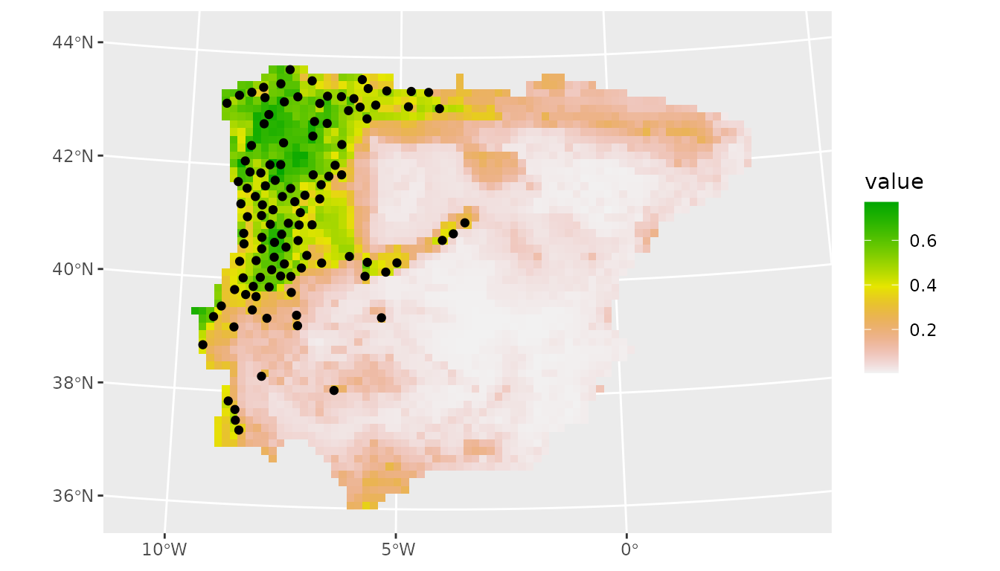

## Exploring models with `DALEX`

An issue with machine learning algorithms is that it is not easy to
understand the role of different variables in giving the final
prediction. A number of packages have been created to explore and
explain the behaviour of ML algorithms, such as those used in `tidysdm`.
In the [`tidysdm`
overview](https://evolecolgroup.github.io/tidysdm/articles/a0_tidysdm_overview.html)
article, we illustrated how to use `recipes` to create profiles.

Here we demonstrate how to use
[DALEX](https://modeloriented.github.io/DALEX/), an excellent package
that has methods to deal with `tidymodels`. `tidysdm` contains
additional functions that allow us to use the DALEX functions directly
on `tidysdm` ensembles.

We will use a simple ensemble that we built in the overview vignette.

``` r
library(tidysdm)
lacerta_ensemble
#> A simple_ensemble of models
#> 
#> Members:
#> • default_glm
#> • default_rf
#> • default_gbm
#> • default_maxent
#> 
#> Available metrics:
#> • boyce_cont
#> • roc_auc
#> • tss_max
#> 
#> Metric used to tune workflows:
#> • boyce_cont
```

The first step in DALEX is to create an explainer object, which can then
be queried by different functions in the package, to turn the explainer
into an explanation (following the DALEX lingo). As a first step, we use
the custom function `explain_tidysdm` to generate our explainer:

``` r
explainer_lacerta_ens <- explain_tidysdm(lacerta_ensemble)
#> Preparation of a new explainer is initiated
#>   -> model label       :  data.frame  (  default  )
#>   -> data              :  448  rows  4  cols 
#>   -> data              :  tibble converted into a data.frame 
#>   -> target variable   :  448  values 
#>   -> predict function  :  predict_function 
#>   -> predicted values  :  Predict function column set to:  1 (  OK  )
#>   -> model_info        :  package tidysdm , ver. 1.0.4.9001 , task classification (  default  ) 
#>   -> model_info        :  type set to  classification 
#>   -> predicted values  :  numerical, min =  0.02117606 , mean =  0.2977721 , max =  0.8709933  
#>   -> residual function :  difference between y and yhat (  default  )
#>   -> residuals         :  numerical, min =  0.1290067 , mean =  1.452228 , max =  1.978824  
#>   A new explainer has been created!
```

Now that we have our explainer, we can explore variable importance for
the ensemble:

``` r
library(DALEX)
#> Welcome to DALEX (version: 2.5.3).
#> Find examples and detailed introduction at: http://ema.drwhy.ai/
#> Additional features will be available after installation of: ggpubr.
#> Use 'install_dependencies()' to get all suggested dependencies
#> 
#> Attaching package: 'DALEX'
#> The following object is masked from 'package:dplyr':
#> 
#>     explain
vip_ensemble <- model_parts(explainer = explainer_lacerta_ens)
plot(vip_ensemble)
#> Warning: Using `size` aesthetic for lines was deprecated in ggplot2 3.4.0.
#> ℹ Please use `linewidth` instead.
#> ℹ The deprecated feature was likely used in the ingredients package.
#>   Please report the issue at
#>   <https://github.com/ModelOriented/ingredients/issues>.
#> This warning is displayed once per session.
#> Call `lifecycle::last_lifecycle_warnings()` to see where this warning was
#> generated.
```

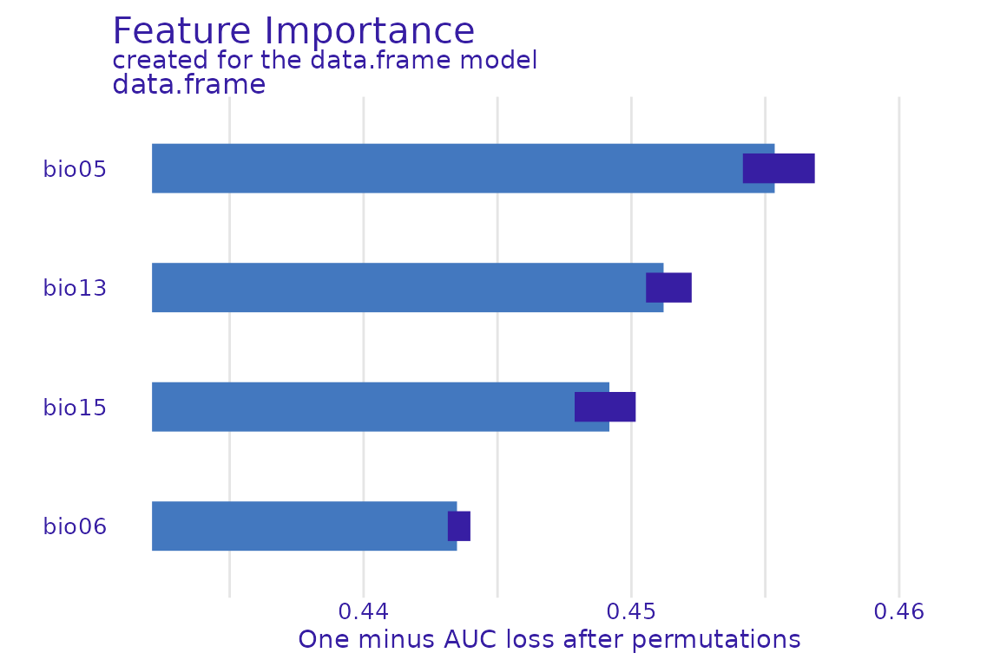

Or generate partial dependency plots for a given variable (e.g. bio05):

``` r
pdp_bio05 <- model_profile(explainer_lacerta_ens, N = 500, variables = "bio05")
plot(pdp_bio05)
```

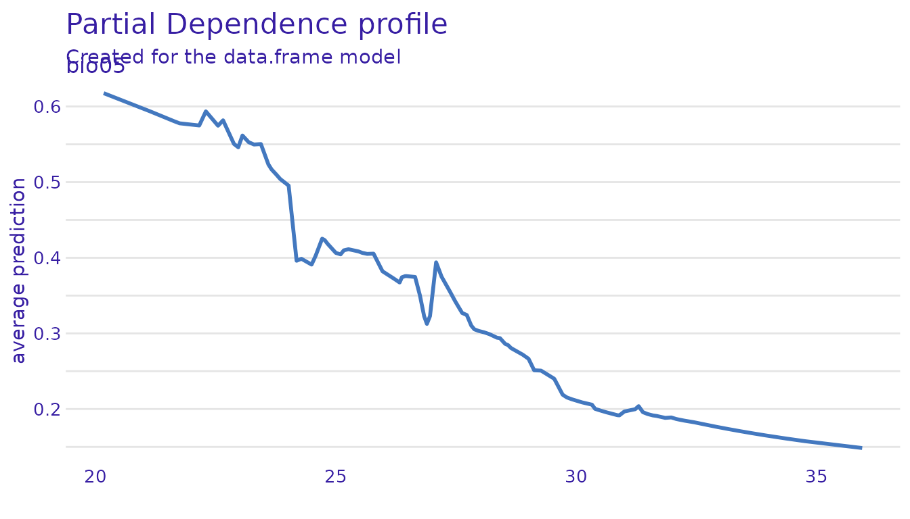

There are many other functions in DALEX that can be applied to the
explainer to further explore the behaviour of the model; see several
tutorials on <https://modeloriented.github.io/DALEX/> for more details.

It is also possible to explore the individual models that make up the
ensemble:

``` r
explainer_list <- explain_tidysdm(tidysdm::lacerta_ensemble, by_workflow = TRUE)
#> Warning: Unknown or uninitialised column: `pre`.
#> Preparation of a new explainer is initiated
#>   -> model label       :  default_glm 
#>   -> data              :  448  rows  4  cols 
#>   -> data              :  tibble converted into a data.frame 
#>   -> target variable   :  448  values 
#>   -> predict function  :  yhat.workflow  will be used (  default  )
#>   -> predicted values  :  Predict function column set to:  1 (  OK  )
#>   -> model_info        :  package tidymodels , ver. 1.4.1 , task classification (  default  ) 
#>   -> model_info        :  type set to  classification 
#>   -> predicted values  :  numerical, min =  0.01618118 , mean =  0.25 , max =  0.7445644  
#>   -> residual function :  difference between y and yhat (  default  )
#>   -> residuals         :  numerical, min =  0.3032477 , mean =  1.5 , max =  1.983819  
#>   A new explainer has been created!
#> Warning: Unknown or uninitialised column: `pre`.
#> Preparation of a new explainer is initiated
#>   -> model label       :  default_rf 
#>   -> data              :  448  rows  4  cols 
#>   -> data              :  tibble converted into a data.frame 
#>   -> target variable   :  448  values 
#>   -> predict function  :  yhat.workflow  will be used (  default  )
#>   -> predicted values  :  Predict function column set to:  1 (  OK  )
#>   -> model_info        :  package tidymodels , ver. 1.4.1 , task classification (  default  ) 
#>   -> model_info        :  type set to  classification 
#>   -> predicted values  :  numerical, min =  0 , mean =  0.2506163 , max =  0.9258611  
#>   -> residual function :  difference between y and yhat (  default  )
#>   -> residuals         :  numerical, min =  0.07413889 , mean =  1.499384 , max =  2  
#>   A new explainer has been created!
#> Warning: Unknown or uninitialised column: `pre`.
#> Preparation of a new explainer is initiated
#>   -> model label       :  default_gbm 
#>   -> data              :  448  rows  4  cols 
#>   -> data              :  tibble converted into a data.frame 
#>   -> target variable   :  448  values 
#>   -> predict function  :  yhat.workflow  will be used (  default  )
#>   -> predicted values  :  Predict function column set to:  1 (  OK  )
#>   -> model_info        :  package tidymodels , ver. 1.4.1 , task classification (  default  ) 
#>   -> model_info        :  type set to  classification 
#>   -> predicted values  :  numerical, min =  0.0002722652 , mean =  0.2500301 , max =  0.9969552  
#>   -> residual function :  difference between y and yhat (  default  )
#>   -> residuals         :  numerical, min =  0.003044844 , mean =  1.49997 , max =  1.999728  
#>   A new explainer has been created!
#> Warning: Unknown or uninitialised column: `pre`.
#> Preparation of a new explainer is initiated
#>   -> model label       :  default_maxent 
#>   -> data              :  448  rows  4  cols 
#>   -> data              :  tibble converted into a data.frame 
#>   -> target variable   :  448  values 
#>   -> predict function  :  yhat.workflow  will be used (  default  )
#>   -> predicted values  :  Predict function column set to:  1 (  OK  )
#>   -> model_info        :  package tidymodels , ver. 1.4.1 , task classification (  default  ) 
#>   -> model_info        :  type set to  classification 
#>   -> predicted values  :  numerical, min =  0.06587215 , mean =  0.4404422 , max =  0.9522016  
#>   -> residual function :  difference between y and yhat (  default  )
#>   -> residuals         :  numerical, min =  0.07163309 , mean =  1.309558 , max =  1.934128  
#>   A new explainer has been created!
```

The resulting list can be then used to build lists of explanations,
which can then be plotted.

``` r
profile_list <- lapply(explainer_list, model_profile,
  N = 500,
  variables = "bio05"
)
plot(profile_list)
#> Warning: `aes_string()` was deprecated in ggplot2 3.0.0.
#> ℹ Please use tidy evaluation idioms with `aes()`.
#> ℹ See also `vignette("ggplot2-in-packages")` for more information.
#> ℹ The deprecated feature was likely used in the ingredients package.
#>   Please report the issue at
#>   <https://github.com/ModelOriented/ingredients/issues>.
#> This warning is displayed once per session.
#> Call `lifecycle::last_lifecycle_warnings()` to see where this warning was
#> generated.
```

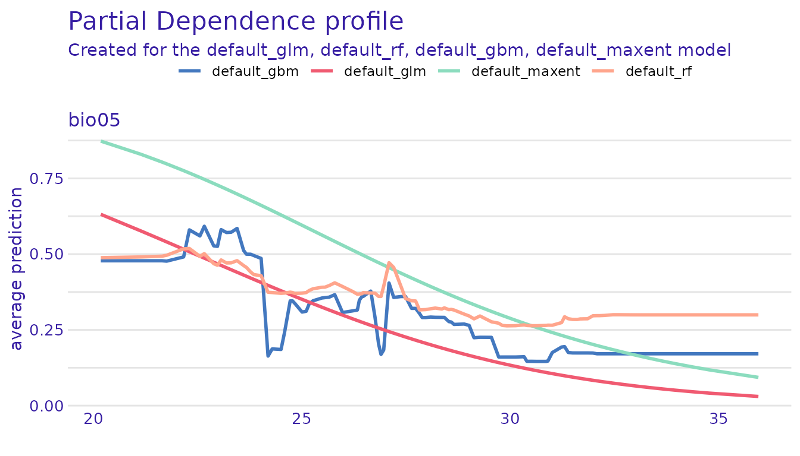

## Different recipes for certain models

Some model types (e.g. GLMs and SVMs) can be sensitive to
multicollinearity among predictors, while others (notably random
forests) are generally more robust to correlated inputs. In this
section, we create two separate recipes: one that keeps all predictors,
and another that retains only a reduced set of weakly correlated
variables.

Load the data:

``` r
library(tidysdm)
library(sf)
#> Linking to GEOS 3.12.1, GDAL 3.8.4, PROJ 9.4.0; sf_use_s2() is TRUE
lacerta_thin <- readRDS(system.file("extdata/lacerta_thin_all_vars.rds",
  package = "tidysdm"
))
```

We then create two recipes: one that keeps all variables, and another
that removes highly correlated ones.

``` r
lacerta_rec_all <- recipe(lacerta_thin, formula = class ~ .)
lacerta_rec_uncor <- lacerta_rec_all %>%
  step_rm(all_of(c(
    "bio01", "bio02", "bio03", "bio04", "bio07", "bio08",
    "bio09", "bio10", "bio11", "bio12", "bio14", "bio16",
    "bio17", "bio18", "bio19", "altitude"
  )))

lacerta_rec_uncor
#> 
#> ── Recipe ──────────────────────────────────────────────────────────────────────
#> 
#> ── Inputs
#> Number of variables by role
#> outcome:    1
#> predictor: 20
#> coords:     2
#> 
#> ── Operations
#> • Variables removed: all_of(c("bio01", "bio02", "bio03", "bio04", "bio07",
#>   "bio08", "bio09", "bio10", "bio11", "bio12", "bio14", "bio16", "bio17",
#>   "bio18", "bio19", "altitude"))
```

And now use these two recipes in a `workflowset` (we will keep it small
for computational time), selecting the appropriate recipe for each
model. We will include a model (polynomial support vector machines, or
SVM) which does not have a wrapper in `tidysdm` for creating a model
specification. However, we can use a standard model spec from `parsnip`:

``` r
lacerta_models <-
  # create the workflow_set
  workflow_set(
    preproc = list(
      uncor = lacerta_rec_uncor, # recipe for the glm
      all = lacerta_rec_all, # recipe for the random forest
      uncor = lacerta_rec_uncor # recipe for svm
    ),
    models = list(
      # the standard glm specs
      glm = sdm_spec_glm(),
      # rf specs with tuning
      rf = sdm_spec_rf(),
      # svm specs with tuning
      svm = parsnip::svm_poly(
        cost = tune::tune(),
        degree = tune::tune()
      ) %>%
        parsnip::set_engine("kernlab") %>%
        parsnip::set_mode("classification")
    ),
    # make all combinations of preproc and models,
    cross = FALSE
  ) %>%
  # tweak controls to store information needed later to create the ensemble
  # note that we use the bayes version as we will use a Bayes search (see later)
  option_add(control = stacks::control_stack_bayes())
#> Registered S3 method overwritten by 'butcher':
#>   method                 from    
#>   as.character.dev_topic generics
```

We can now use the block CV folds to tune and assess the models. Note
that there are multiple tuning approaches, besides the standard grid
method. Here we will use `tune_bayes` from the `tune` package (see its
help page to see how a Gaussian Process model is used to choose
parameter combinations).

This tuning method (as opposed to use a standard grid) does not allow
for hyper-parameters with unknown limits, but `mtry` for random forest
is undefined as its upper range depends on the number of variables in
the dataset. So, before tuning, we need to finalise `mtry` by informing
the set dials with the actual data:

``` r
set.seed(100)
# create the CV folds
lacerta_cv <- spatial_block_cv(lacerta_thin, v = 3)

# extract and finalize the rf parameters
rf_param <- lacerta_models %>%
  # extract the rf workflow
  extract_workflow("all_rf") %>%
  # extract its parameters dials (used to tune)
  extract_parameter_set_dials() %>%
  # give it the predictors to finalize mtry
  finalize(x = st_drop_geometry(lacerta_thin) %>% select(-class))

# now update the workflowset with the new parameter info
lacerta_models <- lacerta_models %>%
  option_add(param_info = rf_param, id = "all_rf")
```

And now we can tune the models:

``` r
set.seed(1234567)
lacerta_models <-
  lacerta_models %>%
  workflow_map("tune_bayes",
    resamples = lacerta_cv, initial = 8,
    metrics = sdm_metric_set(), verbose = TRUE
  )
#> Warning: Using `all_of()` outside of a selecting function was deprecated in tidyselect
#> 1.2.0.
#> ℹ See details at
#>   <https://tidyselect.r-lib.org/reference/faq-selection-context.html>
#> This warning is displayed once per session.
#> Call `lifecycle::last_lifecycle_warnings()` to see where this warning was
#> generated.
#> i  No tuning parameters. `fit_resamples()` will be attempted
#> i 1 of 3 resampling: uncor_glm
#> ✔ 1 of 3 resampling: uncor_glm (367ms)
#> i 2 of 3 tuning:     all_rf
#> ! No improvement for 10 iterations; returning current results.
#> ✔ 2 of 3 tuning:     all_rf (17.6s)
#> i 3 of 3 tuning:     uncor_svm
#> maximum number of iterations reached 0.003456553 -0.003390584maximum number of iterations reached 0.004873408 -0.004689518maximum number of iterations reached 2.43803e-05 -2.435951e-05maximum number of iterations reached 0.003562052 -0.003477793maximum number of iterations reached 0.0002060528 -0.0002059063
#> ✔ 3 of 3 tuning:     uncor_svm (21.8s)
```

We can have a look at the performance of our models with:

``` r
autoplot(lacerta_models)
```

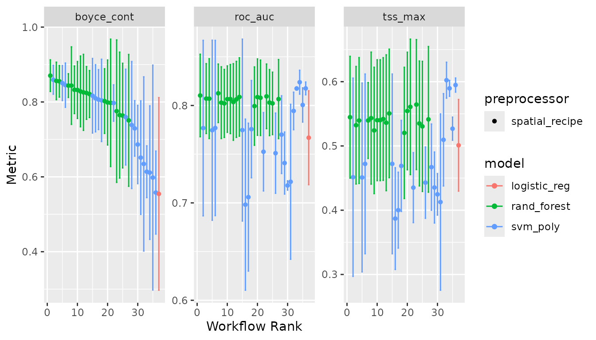

## The initial split

The standard `tidymodels` workflow begins by splitting the data into a
**training set** (used to fit and tune models) and an **independent
testing set** (held out for final evaluation). This step is essential
for getting an honest estimate of predictive performance of any SDM, yet
it has often been omitted in traditional SDM practice, where model
assessment has instead relied primarily on (spatial) cross-validation.
This is largely for historical reasons: SDM datasets were frequently
small, and holding data back for testing felt too costly.

In this section, we demonstrate a robust approach by holding out 20% of
the data (1/5) for testing and using the remaining 80% for training.
While we strongly recommend this approach whenever the data allow, we
acknowledge that it can be data-hungry and may not always be feasible
for smaller datasets. We therefore recommend exploring multiple random
seeds for the initial split to assess the sensitivity of results to a
particular partition, and to avoid splitting the data when results are
highly sensitive and unstable.

We start by loading a set of presences and absences and their associated
climate, analogous to the one that we generated in the [`tidysdm`
overview](https://evolecolgroup.github.io/tidysdm/articles/a0_tidysdm_overview.html)
article:

``` r
library(tidysdm)
library(sf)
library(tidyterra)
lacerta_thin <- readRDS(system.file("extdata/lacerta_thin_all_vars.rds",
  package = "tidysdm"
))
```

We then use `spatial_initial_split` to do the split, using a
`spatial_block_cv` scheme to partition the data:

``` r
set.seed(1005)
lacerta_initial <- spatial_initial_split(lacerta_thin,
  prop = 1 / 5, spatial_block_cv
)
autoplot(lacerta_initial)
```

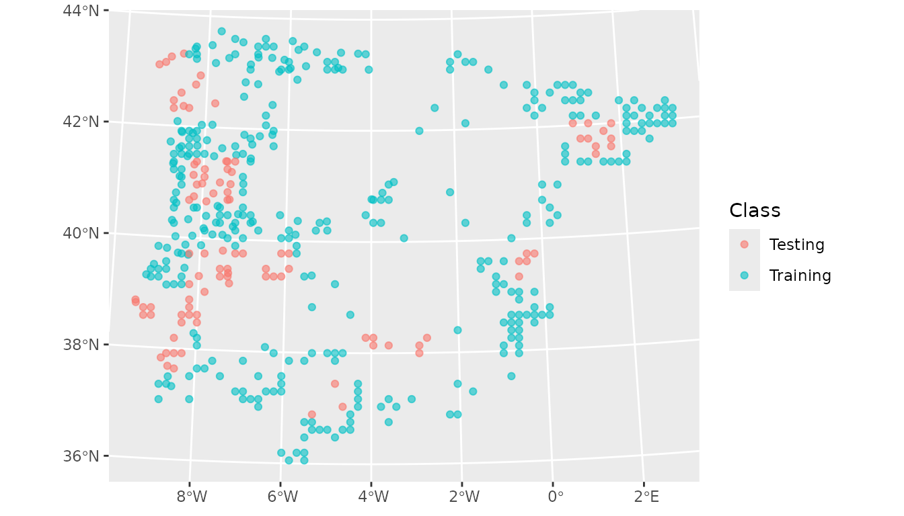

And check the balance of presences vs pseudoabsences:

``` r
check_splits_balance(lacerta_initial, class)
#> # A tibble: 1 × 4
#>   presence_test background_test presence_train background_train
#>           <int>           <int>          <int>            <int>
#> 1            86             263             26               73
```

And confirm that we have the data correctly formatted with:

``` r
lacerta_thin %>% check_sdm_presence(class)
#> [1] TRUE
```

We can now extract the training set from our `lacerta_initial` split,
and sample folds to set up cross validation (note that we set the
`cellsize` and `offset` based on the full dataset, `lacerta_thin`; this
allows us to use the same grid we used for the `initial_split`). In this
example, we also have to add a very small number to the offset to avoid
an error in the `spatial_block_cv` function arising from some points
falling on the boundary of the grid cells). This is often not necessary,
so only introduce this if you encounter an error.

``` r
set.seed(1005)
lacerta_training <- training(lacerta_initial)
lacerta_cv <- spatial_block_cv(lacerta_training,
  v = 5,
  cellsize = grid_cellsize(lacerta_thin),
  offset = grid_offset(lacerta_thin) + 0.00001
)
autoplot(lacerta_cv)
```

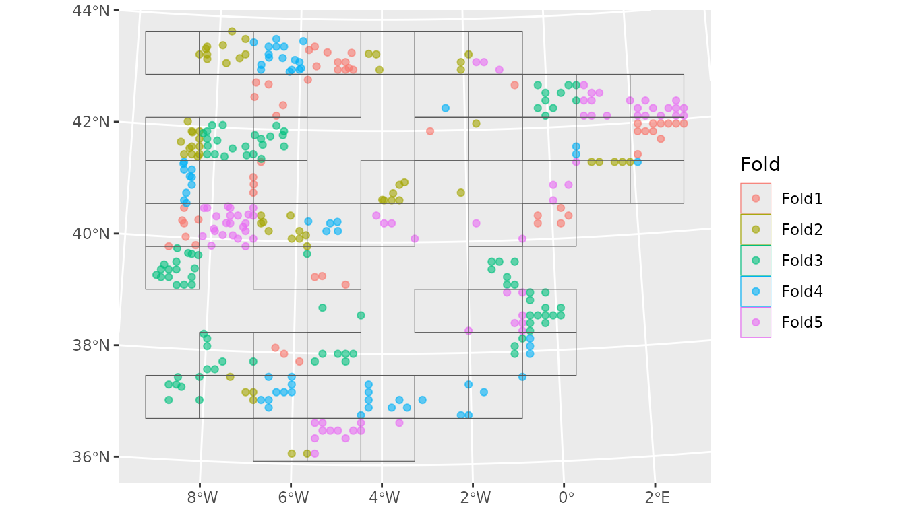

And check the balance in the dataset:

``` r
check_splits_balance(lacerta_cv, class)
#> # A tibble: 5 × 4
#>   presence_assessment background_assessment presence_analysis
#>                 <int>                 <int>             <int>
#> 1                  69                   228                17
#> 2                  67                   222                19
#> 3                  62                   191                24
#> 4                  71                   216                15
#> 5                  75                   197                11
#> # ℹ 1 more variable: background_analysis <int>
```

Next, we need to set up a `recipe` to define how to handle our dataset.

``` r
lacerta_rec <- recipe(lacerta_training, formula = class ~ .)
lacerta_rec
#> 
#> ── Recipe ──────────────────────────────────────────────────────────────────────
#> 
#> ── Inputs
#> Number of variables by role
#> outcome:    1
#> predictor: 20
#> coords:     2
```

Same as in the [`tidysdm`
overview](https://evolecolgroup.github.io/tidysdm/articles/a0_tidysdm_overview.html)
article we can now build a `workflow_set` of different models:

``` r
lacerta_models <-
  # create the workflow_set
  workflow_set(
    preproc = list(default = lacerta_rec),
    models = list(
      # the standard glm specs
      glm = sdm_spec_glm(),
      # rf specs with tuning
      rf = sdm_spec_rf(),
      # boosted tree model (gbm) specs with tuning
      gbm = sdm_spec_boost_tree(),
      # maxent specs with tuning
      maxent = sdm_spec_maxent()
    ),
    # make all combinations of preproc and models,
    cross = TRUE
  ) %>%
  # tweak controls to store information needed later to create the ensemble
  option_add(control = control_ensemble_grid())
```

And use the block CV folds to tune and assess the models:

``` r
set.seed(1234567)
lacerta_models <-
  lacerta_models %>%
  workflow_map("tune_grid",
    resamples = lacerta_cv, grid = 3,
    metrics = sdm_metric_set(), verbose = TRUE
  )
#> i  No tuning parameters. `fit_resamples()` will be attempted
#> i 1 of 4 resampling: default_glm
#> → A | warning: glm.fit: fitted probabilities numerically 0 or 1 occurred
#> There were issues with some computations   A: x1
#> There were issues with some computations   A: x2
#> 
#> ✔ 1 of 4 resampling: default_glm (580ms)
#> i 2 of 4 tuning:     default_rf
#> i Creating pre-processing data to finalize 1 unknown parameter: "mtry"
#> ✔ 2 of 4 tuning:     default_rf (3.7s)
#> i 3 of 4 tuning:     default_gbm
#> i Creating pre-processing data to finalize 1 unknown parameter: "mtry"
#> → A | warning: `early_stop` was reduced to 0.
#> There were issues with some computations   A: x1
#> There were issues with some computations   A: x2
#> There were issues with some computations   A: x3
#> There were issues with some computations   A: x5
#> There were issues with some computations   A: x5
#> 
#> ✔ 3 of 4 tuning:     default_gbm (11.3s)
#> i 4 of 4 tuning:     default_maxent
#> ✔ 4 of 4 tuning:     default_maxent (2.4s)

autoplot(lacerta_models)
```

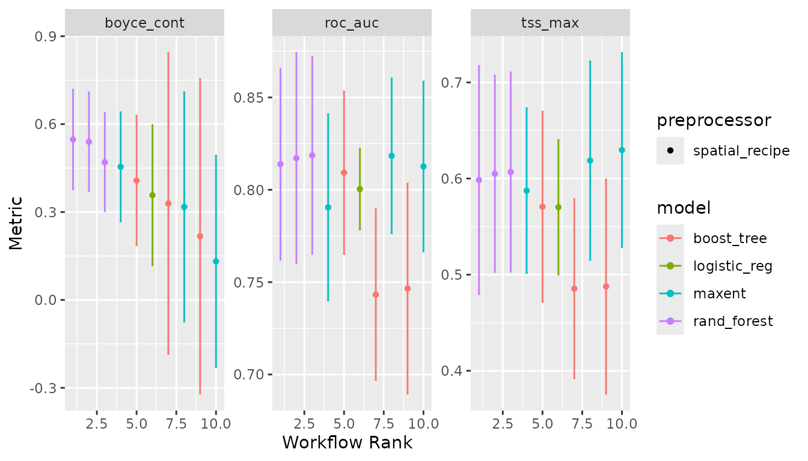

And create an ensemble, selecting the best set of parameters for each
model using Boyce continuous index as our metric:

``` r
lacerta_ensemble <- simple_ensemble() %>%
  add_member(lacerta_models, metric = "boyce_cont")

autoplot(lacerta_ensemble)
```

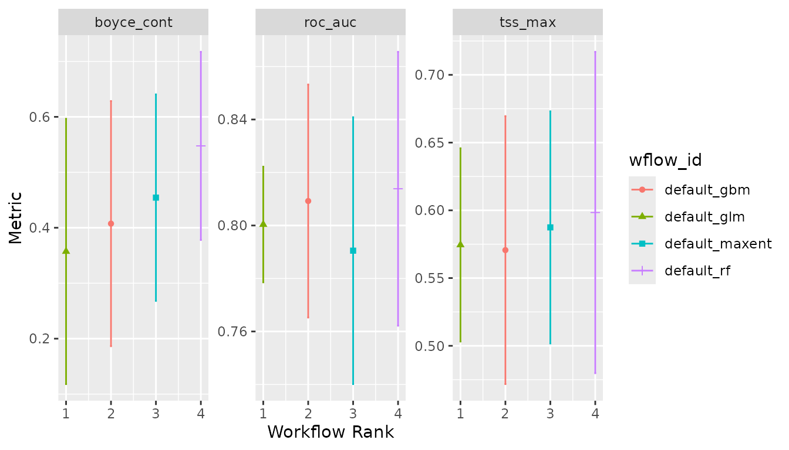

We can now use the ensemble to make predictions about the testing data:

``` r
lacerta_testing <- testing(lacerta_initial)

lacerta_test_pred <-
  lacerta_testing %>%
  bind_cols(predict(lacerta_ensemble, ., type = "prob"))
```

And look at the goodness of fit:

``` r
sdm_metric_set()(data = lacerta_test_pred, truth = class, mean)
#> # A tibble: 3 × 3
#>   .metric    .estimator .estimate
#>   <chr>      <chr>          <dbl>
#> 1 boyce_cont binary         0.718
#> 2 roc_auc    binary         0.784
#> 3 tss_max    binary         0.485
```

We can now make predictions with this ensemble using the best models.

``` r
# load climate data
climate_present <- terra::readRDS(
  system.file("extdata/lacerta_climate_present_10m.rds",
    package = "tidysdm"
  )
)

# project climate layers
iberia_proj4 <- paste0(
  "+proj=aea +lon_0=-4.0 +lat_1=36.8 +lat_2=42.6 ",
  "+lat_0=39.7 +datum=WGS84 +units=m +no_defs"
)
climate_present <- terra::project(climate_present, y = iberia_proj4)

# predict using only the best models
prediction_present_boyce <- predict_raster(lacerta_ensemble, climate_present,
  metric_thresh = c("boyce_cont", 0.5),
  fun = "median"
)

# plot
ggplot() +
  geom_spatraster(data = prediction_present_boyce, aes(fill = median)) +
  scale_fill_terrain_c() +
  geom_sf(data = lacerta_thin %>% filter(class == "presence"))
```

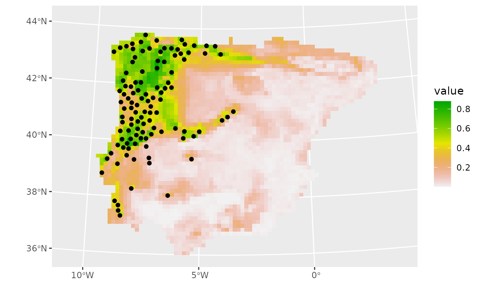

## Stack ensembles

Now that we have an explicit training/testing split (see the [previous
section](#initial-split) section), we can go beyond a simple ensemble
that keeps only the single best configuration of each model type and
averages their predictions. Instead, we can build a stack ensemble using
the `stacks` package. Stacking fits a meta-learner that learns how to
optimally weight predictions from multiple candidate models, including
multiple tuned versions of the same algorithm with different
hyper-parameters, so that the final ensemble can exploit complementary
strengths across model configurations.

An explicit testing split is not strictly required for stacking, since
model performance can be estimated using cross-validation. However, an
independent test set is recommended whenever an unbiased estimate of the
final model’s predictive performance is required. This is particularly
important for stacked ensembles, which can be prone to overfitting.

``` r
library(stacks)
set.seed(1005)
lacerta_stack <-
  # initialize the stack
  stacks() %>%
  # add candidate members
  add_candidates(lacerta_models) %>%
  # determine how to combine their predictions
  blend_predictions(
    metric = sdm_metric_set() # use our SDM metrics for calculating stacking
    # coefficients
  ) %>%
  # fit candidates with non-zero weights (i.e. non-zero stacking coefficients)
  fit_members()
#> Warning: The inputted `candidates` argument `default_glm` generated notes during
#> tuning/resampling. Model stacking may fail due to these issues; see
#> `collect_notes()` (`?tune::collect_notes()`) if so.
#> Warning: The inputted `candidates` argument `default_gbm` generated notes during
#> tuning/resampling. Model stacking may fail due to these issues; see
#> `collect_notes()` (`?tune::collect_notes()`) if so.

autoplot(lacerta_stack, type = "weights")
```

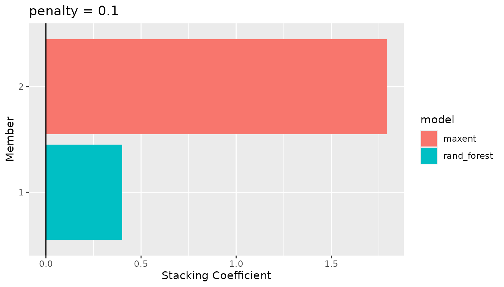

In this example, one random forest variant and one SVM variant were
selected (though more can be, depending on tuning and the data). The
stacking coefficients indicate how much weight each selected model
contributes to the final ensemble prediction. We can now use the
ensemble to make predictions about the testing data:

``` r
lacerta_testing <- testing(lacerta_initial)

lacerta_test_pred <-
  lacerta_testing %>%
  bind_cols(predict(lacerta_stack, ., type = "prob"))
```

And look at the goodness of fit using some commonly used sdm metrics.
Note that `sdm_metric_set` is first invoked to generate a function (with
empty `()`) that is then used on the data.

``` r
sdm_metric_set()(data = lacerta_test_pred, truth = class, .pred_presence)
#> # A tibble: 3 × 3
#>   .metric    .estimator .estimate
#>   <chr>      <chr>          <dbl>
#> 1 boyce_cont binary         0.464
#> 2 roc_auc    binary         0.823
#> 3 tss_max    binary         0.600
```

We can now make predictions with this stacked ensemble. We start by
extracting the climate for the variables of interest:

``` r
climate_present <- terra::readRDS(
  system.file("extdata/lacerta_climate_present_10m.rds",
    package = "tidysdm"
  )
)

# project climate layers
iberia_proj4 <- paste0(
  "+proj=aea +lon_0=-4.0 +lat_1=36.8 +lat_2=42.6",
  " +lat_0=39.7 +datum=WGS84 +units=m +no_defs"
)
climate_present <- terra::project(climate_present, y = iberia_proj4)
```

And predict the presence of the lizard using the stacked ensemble:

``` r
prediction_present <- predict_raster(lacerta_stack, climate_present,
  type = "prob"
)
library(tidyterra)
ggplot() +
  geom_spatraster(data = prediction_present, aes(fill = .pred_presence)) +
  scale_fill_terrain_c() +
  # plot presences used in the model
  geom_sf(data = lacerta_thin %>% filter(class == "presence"))
```

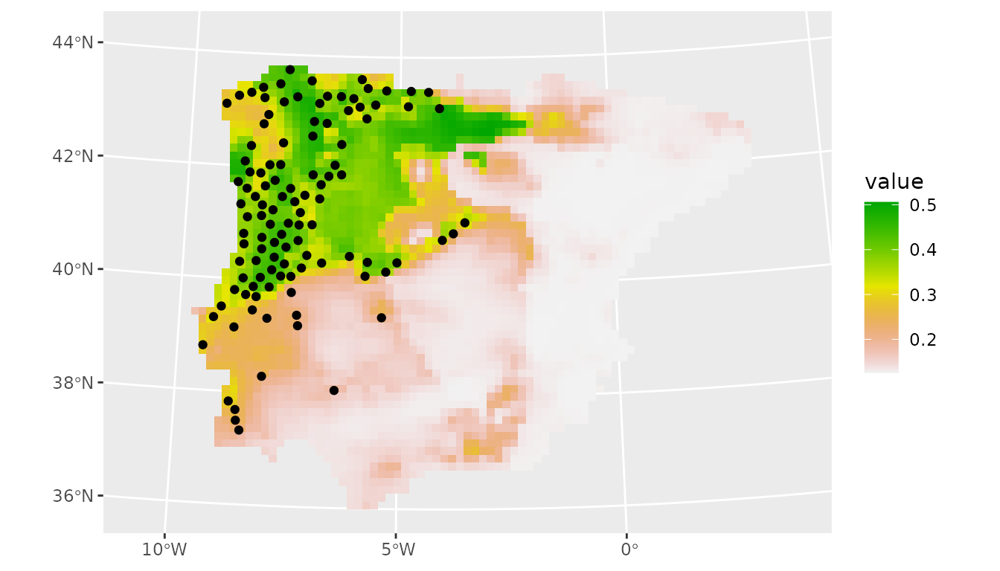
