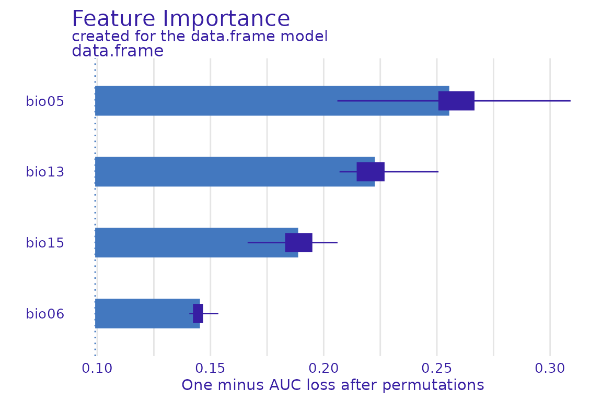
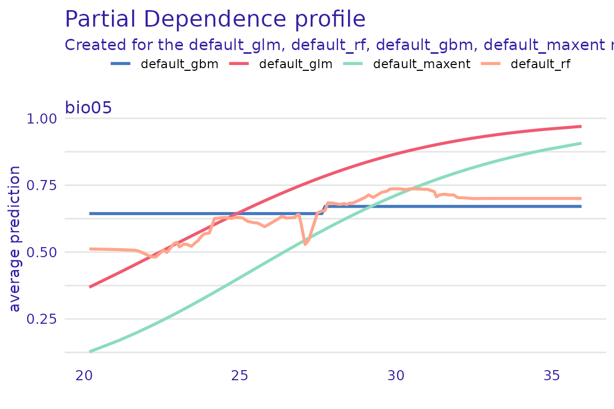
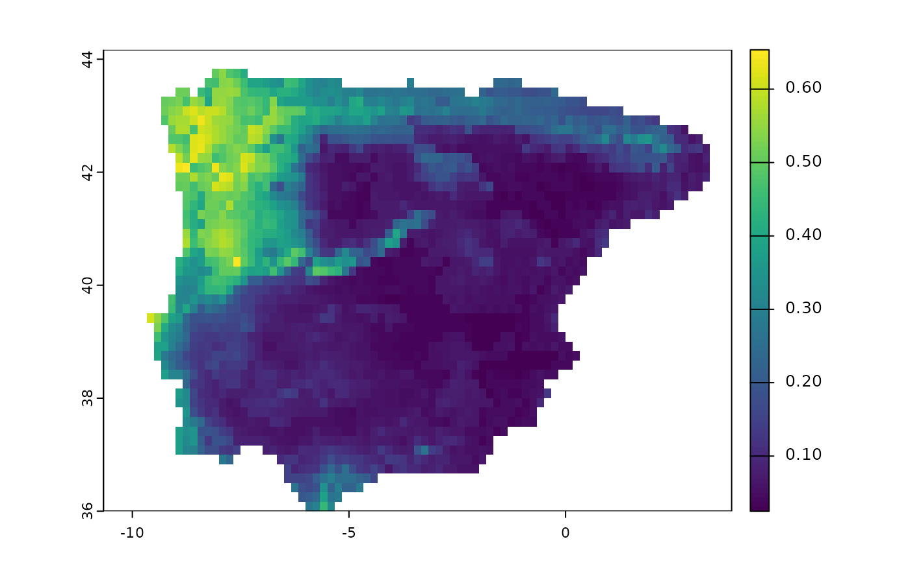

# Examples of additional tidymodels features

In this vignette, we illustrate how a number of features from
`tidymodels` can be used to enhance a conventional SDM pipeline. We
recommend users first become familiar with `tidymodels`; there are a
number of excellent tutorials (both introductory and advanced) on its
dedicated [website](https://www.tidymodels.org/) We reuse the example on
the Iberian lizard that we used in the [`tidysdm`
overview](https://evolecolgroup.github.io/tidysdm/articles/a0_tidysdm_overview.html)
article.

## Exploring models with `DALEX`

An issue with machine learning algorithms is that it is not easy to
understand the role of different variables in giving the final
prediction. A number of packages have been created to explore and
explain the behaviour of ML algorithms, such as those used in `tidysdm`.
In the [`tidysdm`
overview](https://evolecolgroup.github.io/tidysdm/articles/a0_tidysdm_overview.html)
article, we illustrated how to use `recipes` to create profiles.

Here we demonstrate how to use
[DALEX](https://modeloriented.github.io/DALEX/), an excellent package
that has methods to deal with `tidymodels`. `tidysdm` contains
additional functions that allow use to use the DALEX functions directly
on `tidysdm` ensembles.

We will use a simple ensemble that we built in the overview vignette.

``` r
library(tidysdm)
#> Loading required package: tidymodels
#> ── Attaching packages ────────────────────────────────────── tidymodels 1.4.1 ──
#> ✔ broom        1.0.11     ✔ recipes      1.3.1 
#> ✔ dials        1.4.2      ✔ rsample      1.3.1 
#> ✔ dplyr        1.1.4      ✔ tailor       0.1.0 
#> ✔ ggplot2      4.0.1      ✔ tidyr        1.3.1 
#> ✔ infer        1.0.9      ✔ tune         2.0.1 
#> ✔ modeldata    1.5.1      ✔ workflows    1.3.0 
#> ✔ parsnip      1.4.0      ✔ workflowsets 1.1.1 
#> ✔ purrr        1.2.0      ✔ yardstick    1.3.2
#> ── Conflicts ───────────────────────────────────────── tidymodels_conflicts() ──
#> ✖ purrr::discard() masks scales::discard()
#> ✖ dplyr::filter()  masks stats::filter()
#> ✖ dplyr::lag()     masks stats::lag()
#> ✖ recipes::step()  masks stats::step()
#> Loading required package: spatialsample
lacerta_ensemble
#> A simple_ensemble of models
#> 
#> Members:
#> • default_glm
#> • default_rf
#> • default_gbm
#> • default_maxent
#> 
#> Available metrics:
#> • boyce_cont
#> • roc_auc
#> • tss_max
#> 
#> Metric used to tune workflows:
#> • boyce_cont
```

The first step in DALEX is to create an explainer object, which can then
be queried by different functions in the package, to turn the explainer
into an explanation (following the DALEX lingo). As a first step, we use
the custom function `explain_tidysdm` to generate our explainer:

``` r
explainer_lacerta_ens <- explain_tidysdm(lacerta_ensemble)
#> Preparation of a new explainer is initiated
#>   -> model label       :  data.frame  (  default  )
#>   -> data              :  448  rows  4  cols 
#>   -> data              :  tibble converted into a data.frame 
#>   -> target variable   :  448  values 
#>   -> predict function  :  predict_function 
#>   -> predicted values  :  No value for predict function target column. (  default  )
#>   -> model_info        :  package tidysdm , ver. 1.0.3.9002 , task classification (  default  ) 
#>   -> model_info        :  type set to  classification 
#>   -> predicted values  :  numerical, min =  0.02117606 , mean =  0.2977721 , max =  0.8709933  
#>   -> residual function :  difference between y and yhat (  default  )
#>   -> residuals         :  numerical, min =  -0.6238706 , mean =  -0.04777213 , max =  0.6884733  
#>   A new explainer has been created!
```

Now that we have our explainer, we can explore variable importance for
the ensemble:

``` r
library(DALEX)
#> Welcome to DALEX (version: 2.5.3).
#> Find examples and detailed introduction at: http://ema.drwhy.ai/
#> Additional features will be available after installation of: ggpubr.
#> Use 'install_dependencies()' to get all suggested dependencies
#> 
#> Attaching package: 'DALEX'
#> The following object is masked from 'package:dplyr':
#> 
#>     explain
vip_ensemble <- model_parts(explainer = explainer_lacerta_ens)
plot(vip_ensemble)
#> Warning: Using `size` aesthetic for lines was deprecated in ggplot2 3.4.0.
#> ℹ Please use `linewidth` instead.
#> ℹ The deprecated feature was likely used in the ingredients package.
#>   Please report the issue at
#>   <https://github.com/ModelOriented/ingredients/issues>.
#> This warning is displayed once every 8 hours.
#> Call `lifecycle::last_lifecycle_warnings()` to see where this warning was
#> generated.
```



Or generate partial dependency plots for a given variable (e.g. bio05):

``` r
pdp_bio05 <- model_profile(explainer_lacerta_ens, N = 500, variables = "bio05")
plot(pdp_bio05)
```


There are many other functions in DALEX that can be applied to the
explainer to further explore the behaviour of the model; see several
tutorial on <https://modeloriented.github.io/DALEX/>

It is also possible to explore the individual models that make up the
ensemble:

``` r
explainer_list <- explain_tidysdm(tidysdm::lacerta_ensemble, by_workflow = TRUE)
#> Warning: Unknown or uninitialised column: `pre`.
#> Preparation of a new explainer is initiated
#>   -> model label       :  default_glm 
#>   -> data              :  448  rows  4  cols 
#>   -> data              :  tibble converted into a data.frame 
#>   -> target variable   :  448  values 
#>   -> predict function  :  yhat.workflow  will be used (  default  )
#>   -> predicted values  :  No value for predict function target column. (  default  )
#>   -> model_info        :  package tidymodels , ver. 1.4.1 , task classification (  default  ) 
#>   -> model_info        :  type set to  classification 
#>   -> predicted values  :  numerical, min =  0.2554356 , mean =  0.75 , max =  0.9838188  
#>   -> residual function :  difference between y and yhat (  default  )
#>   -> residuals         :  numerical, min =  -0.9838188 , mean =  -0.5 , max =  0.6967523  
#>   A new explainer has been created!
#> Warning: Unknown or uninitialised column: `pre`.
#> Preparation of a new explainer is initiated
#>   -> model label       :  default_rf 
#>   -> data              :  448  rows  4  cols 
#>   -> data              :  tibble converted into a data.frame 
#>   -> target variable   :  448  values 
#>   -> predict function  :  yhat.workflow  will be used (  default  )
#>   -> predicted values  :  No value for predict function target column. (  default  )
#>   -> model_info        :  package tidymodels , ver. 1.4.1 , task classification (  default  ) 
#>   -> model_info        :  type set to  classification 
#>   -> predicted values  :  numerical, min =  0.07413889 , mean =  0.7493837 , max =  1  
#>   -> residual function :  difference between y and yhat (  default  )
#>   -> residuals         :  numerical, min =  -1 , mean =  -0.4993837 , max =  0.9258611  
#>   A new explainer has been created!
#> Warning: Unknown or uninitialised column: `pre`.
#> Preparation of a new explainer is initiated
#>   -> model label       :  default_gbm 
#>   -> data              :  448  rows  4  cols 
#>   -> data              :  tibble converted into a data.frame 
#>   -> target variable   :  448  values 
#>   -> predict function  :  yhat.workflow  will be used (  default  )
#>   -> predicted values  :  No value for predict function target column. (  default  )
#>   -> model_info        :  package tidymodels , ver. 1.4.1 , task classification (  default  ) 
#>   -> model_info        :  type set to  classification 
#>   -> predicted values  :  numerical, min =  0.003044844 , mean =  0.7499699 , max =  0.9997277  
#>   -> residual function :  difference between y and yhat (  default  )
#>   -> residuals         :  numerical, min =  -0.9997277 , mean =  -0.4999699 , max =  0.9969552  
#>   A new explainer has been created!
#> Warning: Unknown or uninitialised column: `pre`.
#> Preparation of a new explainer is initiated
#>   -> model label       :  default_maxent 
#>   -> data              :  448  rows  4  cols 
#>   -> data              :  tibble converted into a data.frame 
#>   -> target variable   :  448  values 
#>   -> predict function  :  yhat.workflow  will be used (  default  )
#>   -> predicted values  :  No value for predict function target column. (  default  )
#>   -> model_info        :  package tidymodels , ver. 1.4.1 , task classification (  default  ) 
#>   -> model_info        :  type set to  classification 
#>   -> predicted values  :  numerical, min =  0.04779839 , mean =  0.5595578 , max =  0.9341279  
#>   -> residual function :  difference between y and yhat (  default  )
#>   -> residuals         :  numerical, min =  -0.9341279 , mean =  -0.3095578 , max =  0.9283669  
#>   A new explainer has been created!
```

The resulting list can be then used to build lists of explanations,
which can then be plotted.

``` r
profile_list <- lapply(explainer_list, model_profile,
  N = 500,
  variables = "bio05"
)
plot(profile_list)
#> Warning: `aes_string()` was deprecated in ggplot2 3.0.0.
#> ℹ Please use tidy evaluation idioms with `aes()`.
#> ℹ See also `vignette("ggplot2-in-packages")` for more information.
#> ℹ The deprecated feature was likely used in the ingredients package.
#>   Please report the issue at
#>   <https://github.com/ModelOriented/ingredients/issues>.
#> This warning is displayed once every 8 hours.
#> Call `lifecycle::last_lifecycle_warnings()` to see where this warning was
#> generated.
```



## The initial split

The standard approach in `tidymodels` is to make an initial split of the
data into a test and a training set. We will use retain 20% of the data
(1/5) for the testing set, and use the rest for training.

We start by loading a set of presences and absences and their associated
climate, analogous to the one that we generated in the [`tidysdm`
overview](https://evolecolgroup.github.io/tidysdm/articles/a0_tidysdm_overview.html)
article:

``` r
library(tidysdm)
library(sf)
#> Linking to GEOS 3.12.1, GDAL 3.8.4, PROJ 9.4.0; sf_use_s2() is TRUE
lacerta_thin <- readRDS(system.file("extdata/lacerta_thin_all_vars.rds",
  package = "tidysdm"
))
```

We then use `spatial_initial_split` to do the split, using a
`spatial_block_cv` scheme to partition the data:

``` r
set.seed(1005)
lacerta_initial <- spatial_initial_split(lacerta_thin,
  prop = 1 / 5, spatial_block_cv
)
autoplot(lacerta_initial)
```


And check the balance of presences vs pseudoabsences:

``` r
check_splits_balance(lacerta_initial, class)
#> # A tibble: 1 × 4
#>   presence_test background_test presence_train background_train
#>           <int>           <int>          <int>            <int>
#> 1            86             263             26               73
```

We can now extract the training set from our `lacerta_initial` split,
and sample folds to set up cross validation (note that we set the
`cellsize` and `offset` based on the full dataset, `lacerta_thin`; this
allows us to use the same grid we used for the `initial_split`). In this
example, we also have add a very small number to the offset to avoid an
error in the `spatial_block_cv` function arising from some points
falling on the boundary of the grid cells). This is often not necessary,
so only introduce this if you encounter an error.

``` r
set.seed(1005)
lacerta_training <- training(lacerta_initial)
lacerta_cv <- spatial_block_cv(lacerta_training,
  v = 5,
  cellsize = grid_cellsize(lacerta_thin),
  offset = grid_offset(lacerta_thin) + 0.00001
)
autoplot(lacerta_cv)
```


And check the balance in the dataset:

``` r
check_splits_balance(lacerta_cv, class)
#> # A tibble: 5 × 4
#>   presence_assessment background_assessment presence_analysis
#>                 <int>                 <int>             <int>
#> 1                  69                   228                17
#> 2                  67                   222                19
#> 3                  62                   191                24
#> 4                  71                   216                15
#> 5                  75                   197                11
#> # ℹ 1 more variable: background_analysis <int>
```

## Different recipes for certain models

Only certain type of models (e.g. glm, svm) struggle with correlated
variables; other algorithms, such as random forests, can handle
correlated variables. So, we will create two recipes, one with all
variables, and one only with the variables that are uncorrelated:

``` r
lacerta_rec_all <- recipe(lacerta_thin, formula = class ~ .)
lacerta_rec_uncor <- lacerta_rec_all %>%
  step_rm(all_of(c(
    "bio01", "bio02", "bio03", "bio04", "bio07", "bio08",
    "bio09", "bio10", "bio11", "bio12", "bio14", "bio16",
    "bio17", "bio18", "bio19", "altitude"
  )))

lacerta_rec_uncor
#> 
#> ── Recipe ──────────────────────────────────────────────────────────────────────
#> 
#> ── Inputs
#> Number of variables by role
#> outcome:    1
#> predictor: 20
#> coords:     2
#> 
#> ── Operations
#> • Variables removed: all_of(c("bio01", "bio02", "bio03", "bio04", "bio07",
#>   "bio08", "bio09", "bio10", "bio11", "bio12", "bio14", "bio16", "bio17",
#>   "bio18", "bio19", "altitude"))
```

And now use these two recipes in a `workflowset` (we will keep it small
for computational time), selecting the appropriate recipe for each
model. We will include a model (polynomial support vector machines, or
SVM) which does not have a wrapper in `tidysdm` for creating a model
specification. However, we can use a standard model spec from
`yardstick`:

``` r
lacerta_models <-
  # create the workflow_set
  workflow_set(
    preproc = list(
      uncor = lacerta_rec_uncor, # recipe for the glm
      all = lacerta_rec_all, # recipe for the random forest
      all = lacerta_rec_uncor # recipe for svm
    ),
    models = list(
      # the standard glm specs
      glm = sdm_spec_glm(),
      # rf specs with tuning
      rf = sdm_spec_rf(),
      # svm specs with tuning
      svm = parsnip::svm_poly(
        cost = tune::tune(),
        degree = tune::tune()
      ) %>%
        parsnip::set_engine("kernlab") %>%
        parsnip::set_mode("classification")
    ),
    # make all combinations of preproc and models,
    cross = FALSE
  ) %>%
  # tweak controls to store information needed later to create the ensemble
  # note that we use the bayes version as we will use a Bayes search (see later)
  option_add(control = stacks::control_stack_bayes())
#> Registered S3 method overwritten by 'butcher':
#>   method                 from    
#>   as.character.dev_topic generics
```

We can now use the block CV folds to tune and assess the models. Note
that there are multiple tuning approaches, besides the standard grid
method. Here we will use `tune_bayes` from the `tune` package (see its
help page to see how a Gaussian Process model is used to choose
parameter combinations).

This tuning method (as opposed to use a standard grid) does not allow
for hyper-parameters with unknown limits, but `mtry` for random forest
is undefined as its upper range depends on the number of variables in
the dataset. So, before tuning, we need to finalise `mtry` by informing
the set dials with the actual data:

``` r
rf_param <- lacerta_models %>%
  # extract the rf workflow
  extract_workflow("all_rf") %>%
  # extract its parameters dials (used to tune)
  extract_parameter_set_dials() %>%
  # give it the predictors to finalize mtry
  finalize(x = st_drop_geometry(lacerta_thin) %>% select(-class))

# now update the workflowset with the new parameter info
lacerta_models <- lacerta_models %>%
  option_add(param_info = rf_param, id = "all_rf")
```

And now we can tune the models:

``` r
set.seed(1234567)
lacerta_models <-
  lacerta_models %>%
  workflow_map("tune_bayes",
    resamples = lacerta_cv, initial = 8,
    metrics = sdm_metric_set(), verbose = TRUE
  )
#> Warning: Using `all_of()` outside of a selecting function was deprecated in tidyselect
#> 1.2.0.
#> ℹ See details at
#>   <https://tidyselect.r-lib.org/reference/faq-selection-context.html>
#> This warning is displayed once every 8 hours.
#> Call `lifecycle::last_lifecycle_warnings()` to see where this warning was
#> generated.
#> i  No tuning parameters. `fit_resamples()` will be attempted
#> i 1 of 3 resampling: uncor_glm
#> ✔ 1 of 3 resampling: uncor_glm (563ms)
#> i 2 of 3 tuning:     all_rf
#> ✔ 2 of 3 tuning:     all_rf (23s)
#> i 3 of 3 tuning:     all_svm
#> maximum number of iterations reached 0.0034067 -0.003351595maximum number of iterations reached 0.001168737 -0.001158111maximum number of iterations reached 0.002921528 -0.002882749maximum number of iterations reached 0.0004828243 -0.000481011maximum number of iterations reached 0.001552743 -0.001540265maximum number of iterations reached 0.0001848999 -0.0001848551maximum number of iterations reached 0.001378261 -0.001375637maximum number of iterations reached 0.002290727 -0.002260986maximum number of iterations reached 0.0001738087 -0.000173766maximum number of iterations reached 4.866901e-05 -4.861083e-05maximum number of iterations reached 0.003507683 -0.003470935maximum number of iterations reached 0.0009094785 -0.0008994086
#> ✔ 3 of 3 tuning:     all_svm (25.1s)
```

We can have a look at the performance of our models with:

``` r
autoplot(lacerta_models)
```


## Stack ensembles

Instead of building a simple ensemble with the best version of each
model type, we can build a stack ensemble, as implemented in the package
`stacks`. Stacking uses a meta-learning algorithm to learn how to best
combine multiple models, including multiple versions of the same
algorithm with different hyper-parameters.

``` r
library(stacks)
set.seed(1005)
lacerta_stack <-
  # initialize the stack
  stacks() %>%
  # add candidate members
  add_candidates(lacerta_models) %>%
  # determine how to combine their predictions
  blend_predictions() %>%
  # fit candidates with non-zero weights (i.e. non-zero stacking coefficients)
  fit_members()

autoplot(lacerta_stack, type = "weights")
```


We can see that three versions of the SVM and one of the random forests
were selected; the stacking coefficients give an indication of the
weight each model carries within the ensemble. We can now use the
ensemble to make predictions about the testing data:

``` r
lacerta_testing <- testing(lacerta_initial)

lacerta_test_pred <-
  lacerta_testing %>%
  bind_cols(predict(lacerta_stack, ., type = "prob"))
```

And look at the goodness of fit using some commonly used sdm metrics.
Note that `sdm_metric_set` is first invoked to generate a function (with
empty `()`) that is then used on the data.

``` r
sdm_metric_set()(data = lacerta_test_pred, truth = class, .pred_presence)
#> # A tibble: 3 × 3
#>   .metric    .estimator .estimate
#>   <chr>      <chr>          <dbl>
#> 1 boyce_cont binary         0.766
#> 2 roc_auc    binary         0.818
#> 3 tss_max    binary         0.553
```

We can now make predictions with this stacked ensemble. We start by
extracting the climate for the variables of interest

``` r
download_dataset("WorldClim_2.1_10m")
climate_vars <- lacerta_rec_all$var_info %>%
  filter(role == "predictor") %>%
  pull(variable)

climate_present <- pastclim::region_slice(
  time_ce = 1985,
  bio_variables = climate_vars,
  data = "WorldClim_2.1_10m",
  crop = iberia_poly
)
```

``` r
prediction_present <- predict_raster(lacerta_stack, climate_present,
  type = "prob"
)
library(tidyterra)
#> 
#> Attaching package: 'tidyterra'
#> The following object is masked from 'package:stats':
#> 
#>     filter
ggplot() +
  geom_spatraster(data = prediction_present, aes(fill = .pred_presence)) +
  scale_fill_terrain_c() +
  # plot presences used in the model
  geom_sf(data = lacerta_thin %>% filter(class == "presence"))
```


## Using multi-level factors as predictors

Most machine learning algorithms do not natively use multilevel factors
as predictors. The solution is to create dummy variables, which are
binary variables that represent the levels of the factor. In
`tidymodels`, this is done using the `step_dummy` function.

Let’s create a factor variable with 3 levels based on altitude.

``` r
library(tidysdm)
# load the dataset
lacerta_thin <- readRDS(system.file("extdata/lacerta_thin_all_vars.rds",
  package = "tidysdm"
))
# create a topography variable with 3 levels based on altitude
lacerta_thin$topography <- cut(lacerta_thin$altitude,
  breaks = c(-Inf, 200, 800, Inf),
  labels = c("plains", "hills", "mountains")
)
table(lacerta_thin$topography)
#> 
#>    plains     hills mountains 
#>       135       231        82
```

We then create the recipe by adding a step to create dummy variables for
the `topography` variable.

``` r
# subset to variable of interest
lacerta_thin <- lacerta_thin %>% select(
  class, bio05, bio06, bio12,
  bio15, topography
)

lacerta_rec <- recipe(lacerta_thin, formula = class ~ .) %>%
  step_dummy(topography)
lacerta_rec
#> 
#> ── Recipe ──────────────────────────────────────────────────────────────────────
#> 
#> ── Inputs
#> Number of variables by role
#> outcome:   1
#> predictor: 5
#> coords:    2
#> 
#> ── Operations
#> • Dummy variables from: topography
```

Let’s us see what this does:

``` r
lacerta_prep <- prep(lacerta_rec)
#> Warning: The `strings_as_factors` argument of `prep.recipe()` is deprecated as of
#> recipes 1.3.0.
#> ℹ Please use the `strings_as_factors` argument of `recipe()` instead.
#> This warning is displayed once every 8 hours.
#> Call `lifecycle::last_lifecycle_warnings()` to see where this warning was
#> generated.
summary(lacerta_prep)
#> # A tibble: 9 × 4
#>   variable             type      role      source  
#>   <chr>                <list>    <chr>     <chr>   
#> 1 bio05                <chr [2]> predictor original
#> 2 bio06                <chr [2]> predictor original
#> 3 bio12                <chr [2]> predictor original
#> 4 bio15                <chr [2]> predictor original
#> 5 X                    <chr [2]> coords    original
#> 6 Y                    <chr [2]> coords    original
#> 7 class                <chr [3]> outcome   original
#> 8 topography_hills     <chr [2]> predictor derived 
#> 9 topography_mountains <chr [2]> predictor derived
```

We have added two “derived” variables, *topography_hills* and
*topography_mountains*, which are binary variables that allow us to code
topography (with plains being used as the reference level, which is
coded by both hills and mountains being 0 for a given location). We can
look at the first few rows of the data to see the new variables by
baking the recipe:

``` r
lacerta_bake <- bake(lacerta_prep, new_data = lacerta_thin)
glimpse(lacerta_bake)
#> Rows: 448
#> Columns: 9
#> $ bio05                <dbl> 24.82805, 25.65241, 24.00614, 28.44062, 28.42171,…
#> $ bio06                <dbl> 3.117023, 2.856565, 1.542353, 6.945411, 4.656421,…
#> $ bio12                <dbl> 1395.0464, 1242.8585, 1380.4235, 563.5615, 965.35…
#> $ bio15                <dbl> 51.12716, 54.19739, 48.76986, 69.05999, 56.29424,…
#> $ X                    <dbl> -347236.6, -289470.9, -328023.1, -399483.3, -3711…
#> $ Y                    <dbl> 226017.27, 194852.58, 236820.42, -254616.60, 2813…
#> $ class                <fct> presence, presence, presence, presence, presence,…
#> $ topography_hills     <dbl> 1, 1, 0, 0, 1, 1, 1, 1, 1, 1, 0, 1, 1, 1, 0, 0, 1…
#> $ topography_mountains <dbl> 0, 0, 1, 0, 0, 0, 0, 0, 0, 0, 0, 0, 0, 0, 0, 1, 0…
```

We can now run the sdm as usual:

``` r
# define the models
lacerta_models <-
  # create the workflow_set
  workflow_set(
    preproc = list(default = lacerta_rec),
    models = list(
      # the standard glm specs
      glm = sdm_spec_glm(),
      # rf specs with tuning
      rf = sdm_spec_rf()
    ),
    # make all combinations of preproc and models,
    cross = TRUE
  ) %>%
  # tweak controls to store information needed later to create the ensemble
  option_add(control = control_ensemble_grid())
# tune
set.seed(100)
lacerta_cv <- spatial_block_cv(lacerta_thin, v = 3)
lacerta_models <-
  lacerta_models %>%
  workflow_map("tune_grid",
    resamples = lacerta_cv, grid = 3,
    metrics = sdm_metric_set(), verbose = TRUE
  )
#> i  No tuning parameters. `fit_resamples()` will be attempted
#> i 1 of 2 resampling: default_glm
#> ✔ 1 of 2 resampling: default_glm (765ms)
#> i 2 of 2 tuning:     default_rf
#> i Creating pre-processing data to finalize 1 unknown parameter: "mtry"
#> ✔ 2 of 2 tuning:     default_rf (1.9s)
# fit the ensemble
lacerta_ensemble <- simple_ensemble() %>%
  add_member(lacerta_models, metric = "boyce_cont")
```

We can now verify that the dummy variables were used by extracting the
model fit from one of the models in the ensemble:

``` r
lacerta_ensemble$workflow[[1]] %>% extract_fit_parsnip()
#> parsnip model object
#> 
#> 
#> Call:  stats::glm(formula = ..y ~ ., family = stats::binomial, data = data)
#> 
#> Coefficients:
#>          (Intercept)                 bio05                 bio06  
#>            -2.244761              0.284021             -0.084121  
#>                bio12                 bio15      topography_hills  
#>            -0.001189             -0.049376             -0.668832  
#> topography_mountains  
#>            -1.181825  
#> 
#> Degrees of Freedom: 447 Total (i.e. Null);  441 Residual
#> Null Deviance:       503.9 
#> Residual Deviance: 401.1     AIC: 415.1
```

We can see that we have coefficients for *topography_hills* and
*topography_mountains*.

Let us now predict the presence of the lizard in the Iberian Peninsula
using the ensemble. Note that, for
[`predict_raster()`](https://evolecolgroup.github.io/tidysdm/dev/reference/predict_raster.md)
to work, the name and levels for a categorical variable need to match
with those used when training the models (i.e. in the recipe with
`step_dummy()`):

``` r
climate_present <- terra::readRDS(
  system.file("extdata/lacerta_climate_present_10m.rds",
    package = "tidysdm"
  )
)
# first we add a topography variable to the climate data
climate_present$topography <- climate_present$altitude
climate_present$topography <- terra::classify(climate_present$topography,
  rcl = c(-Inf, 200, 800, Inf),
  include.lowest = TRUE,
  brackets = TRUE
)
library(terra)
#> terra 1.8.86
#> 
#> Attaching package: 'terra'
#> The following object is masked from 'package:tidyr':
#> 
#>     extract
#> The following object is masked from 'package:dials':
#> 
#>     buffer
#> The following object is masked from 'package:scales':
#> 
#>     rescale
levels(climate_present$topography) <-
  data.frame(ID = c(0, 1, 2), topography = c("plains", "hills", "mountains"))
# now we can predict
predict_factor <- predict_raster(lacerta_ensemble, climate_present)
plot(predict_factor)
```


