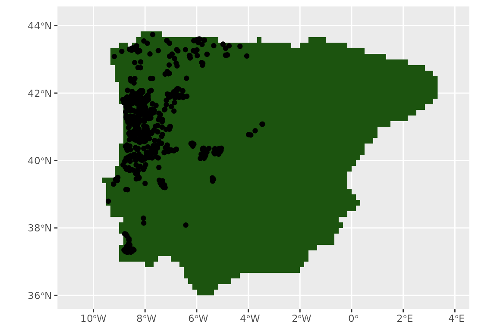
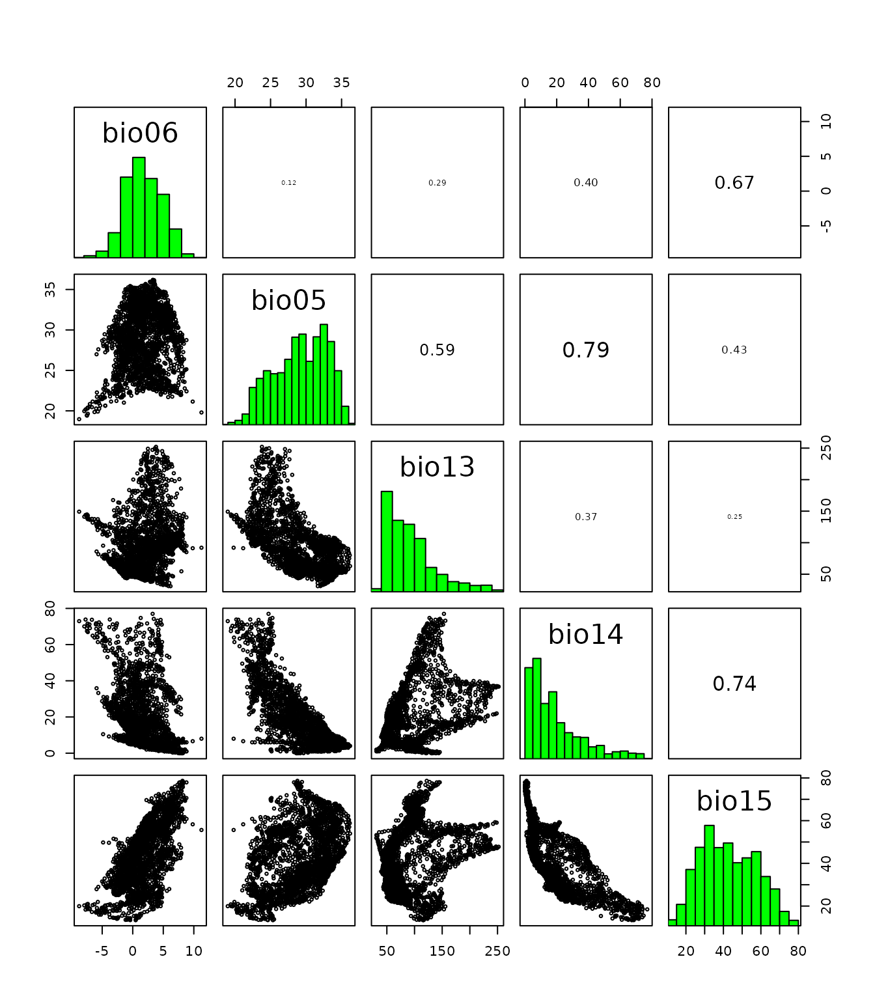
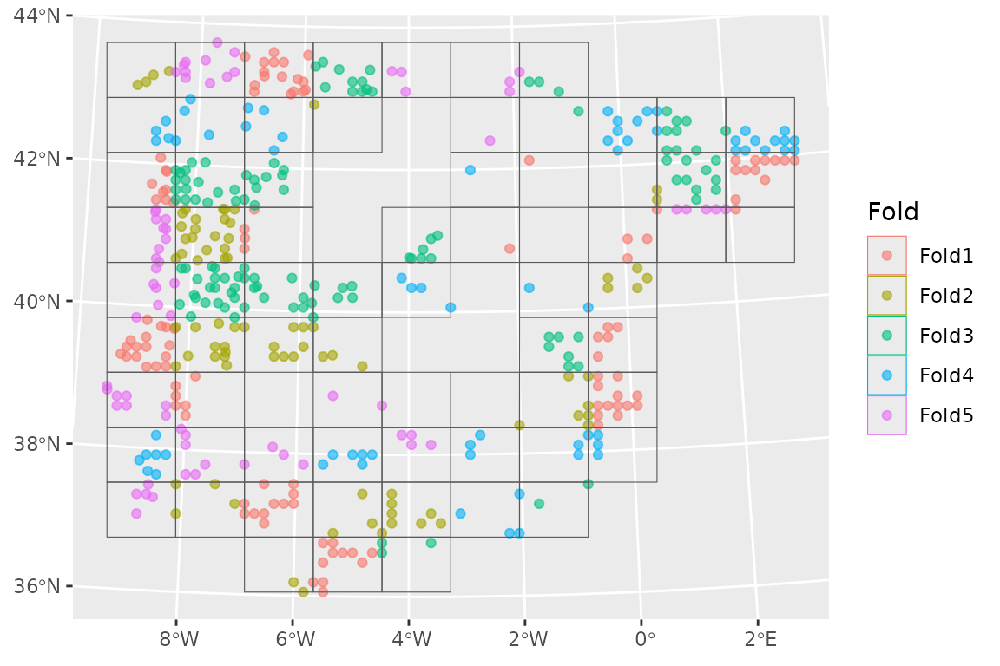
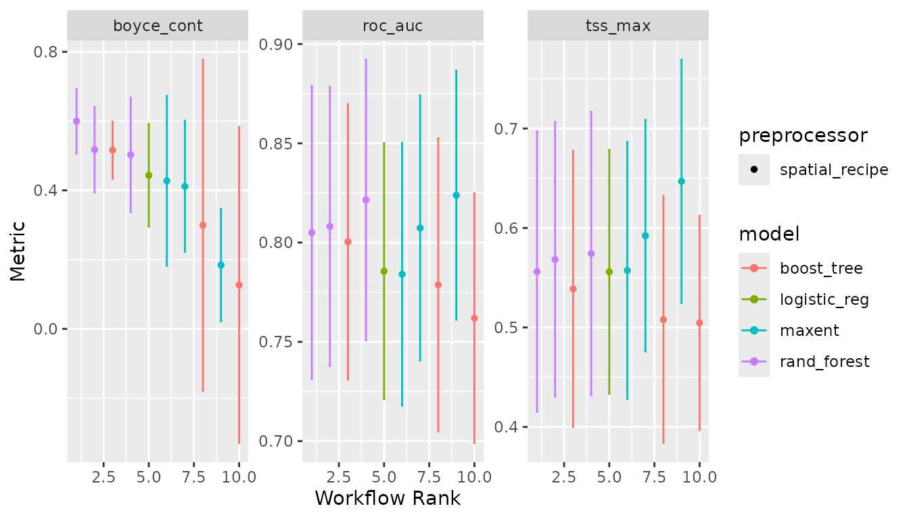
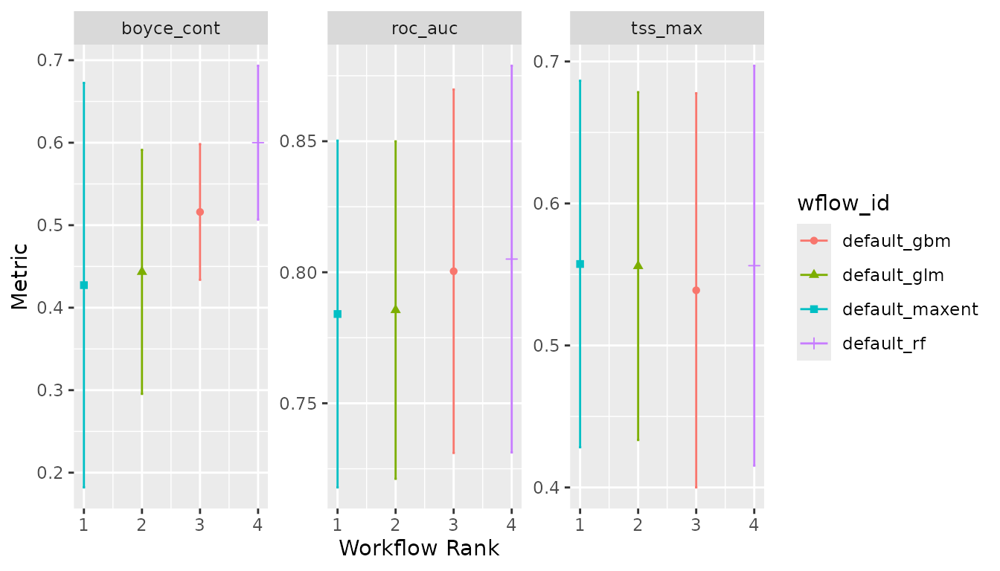
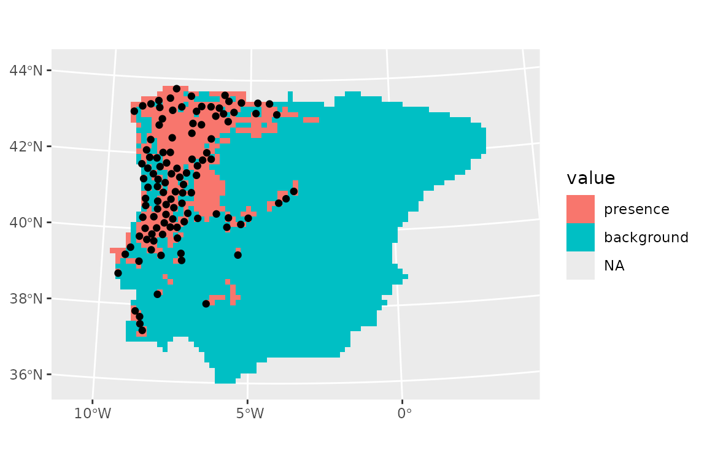
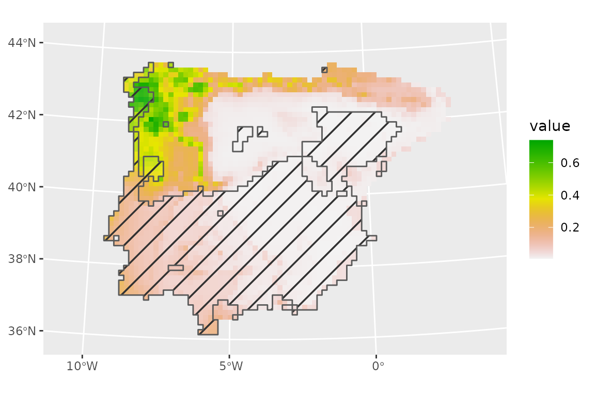

# tidysdm

## SDMs with `tidymodels`

Species Distribution Modelling relies on several algorithms, many of
which have a number of hyperparameters that require turning. The
`tidymodels` universe includes a number of packages specifically design
to fit, tune and validate models. The advantage of `tidymodels` is that
the models syntax and the results returned to the users are
standardised, thus providing a coherent interface to modelling. Given
the variety of models required for SDM, `tidymodels` is an ideal
framework. `tidysdm` provides a number of wrappers and specialised
functions to facilitate the fitting of SDM with `tidymodels`.

This article provides an overview of the how `tidysdm` facilitates
fitting SDMs. Further articles, detailing how to use the package for
palaeodata, fitting more complex models and how to troubleshoot models
can be found on the [`tidisdm`
website](https://evolecolgroup.github.io/tidysdm/). As `tidysdm` relies
on `tidymodels`, users are advised to familiarise themselves with the
introductory tutorials on the [`tidymodels`
website](https://www.tidymodels.org/start/).

When we load `tidysdm`, it automatically loads `tidymodels` and all
associated packages necessary to fit models:

``` r
library(tidysdm)
#> Loading required package: tidymodels
#> ── Attaching packages ────────────────────────────────────── tidymodels 1.4.1 ──
#> ✔ broom        1.0.11     ✔ recipes      1.3.1 
#> ✔ dials        1.4.2      ✔ rsample      1.3.1 
#> ✔ dplyr        1.1.4      ✔ tailor       0.1.0 
#> ✔ ggplot2      4.0.1      ✔ tidyr        1.3.1 
#> ✔ infer        1.0.9      ✔ tune         2.0.1 
#> ✔ modeldata    1.5.1      ✔ workflows    1.3.0 
#> ✔ parsnip      1.4.0      ✔ workflowsets 1.1.1 
#> ✔ purrr        1.2.0      ✔ yardstick    1.3.2
#> ── Conflicts ───────────────────────────────────────── tidymodels_conflicts() ──
#> ✖ purrr::discard() masks scales::discard()
#> ✖ dplyr::filter()  masks stats::filter()
#> ✖ dplyr::lag()     masks stats::lag()
#> ✖ recipes::step()  masks stats::step()
#> Loading required package: spatialsample
```

#### Accessing the data for this vignette: how to use `rgbif`

We start by reading in a set of presences for a species of lizard that
inhabits the Iberian peninsula, *Lacerta schreiberi*. This data is taken
from GBIF Occurrence Download (6 July 2023)
<https://doi.org/10.15468/dl.srq3b3>. The dataset is already included in
the `tidysdm` package:

``` r
data(lacerta)
head(lacerta)
#> # A tibble: 6 × 3
#>          ID latitude longitude
#>       <dbl>    <dbl>     <dbl>
#> 1 858029749     42.6     -7.09
#> 2 858029738     42.6     -7.09
#> 3 614631090     41.4     -7.90
#> 4 614631085     41.3     -7.81
#> 5 614631083     41.3     -7.81
#> 6 614631080     41.4     -7.83
```

Alternatively, we can easily access and manipulate this dataset using
`rbgif`. Note that the data from GBIF often requires some level of
cleaning. Here we will use a simple cleaning function from the
`CoordinateCleaner`; in general, we recommend to inspect the data that
are flagged as problematic, rather than just accepting them as we do
here:

``` r
# download presences
library(rgbif)
occ_download_get(key = "0068808-230530130749713", path = tempdir())
# read file
library(readr)
distrib <- read_delim(file.path(tempdir(), "0068808-230530130749713.zip"))
# keep the necessary columns and rename them
lacerta <- distrib %>%
  select(gbifID, decimalLatitude, decimalLongitude) %>%
  rename(ID = gbifID, latitude = decimalLatitude, longitude = decimalLongitude)
# clean up the data
library(CoordinateCleaner)
lacerta <- clean_coordinates(
  x = lacerta,
  lon = "longitude",
  lat = "latitude",
  species = "ID",
  value = "clean"
)
```

## Preparing your data

First, let us visualise our presences by plotting on a map. `tidysdm`
works with `sf` objects to represent locations, so we will cast our
coordinates into an `sf` object, and set its projections to standard
‘lonlat’ using the proj4 string “+proj=longlat”.

``` r
library(sf)
#> Linking to GEOS 3.12.1, GDAL 3.8.4, PROJ 9.4.0; sf_use_s2() is TRUE
lacerta <- st_as_sf(lacerta, coords = c("longitude", "latitude"))
st_crs(lacerta) <- "+proj=longlat"
```

It is usually advisable to plot the locations directly on the raster
that will be used to extract climatic variables, to see how the
locations fall within the discrete space of the raster. For this
vignette, we will use WorldClim as our source of climatic information.
We will access the WorldClim data via the library `pastclim`; even
though this library, as the name suggests, is mostly designed to handle
palaeoclimatic reconstructions, it also provides convenient functions to
access present day reconstructions and future projections. `pastclim`
has a handy function to get the land mask for the available datasets,
which we can use as background for our locations. We will cut the raster
to the Iberian peninsula, where our lizard lives.

For this example:

``` r
library(pastclim)
download_dataset(dataset = "WorldClim_2.1_10m")
land_mask <-
  get_land_mask(time_ce = 1985, dataset = "WorldClim_2.1_10m")

# Iberia peninsula extension
iberia_poly <-
  terra::vect(
    "POLYGON((-9.8 43.3,-7.8 44.1,-2.0 43.7,3.6 42.5,3.8 41.5,1.3 40.8,0.3 39.5,
     0.9 38.6,-0.4 37.5,-1.6 36.7,-2.3 36.3,-4.1 36.4,-4.5 36.4,-5.0 36.1,
    -5.6 36.0,-6.3 36.0,-7.1 36.9,-9.5 36.6,-9.4 38.0,-10.6 38.9,-9.5 40.8,
    -9.8 43.3))"
  )

crs(iberia_poly) <- "+proj=longlat"
# crop the extent
land_mask <- crop(land_mask, iberia_poly)
# and mask to the polygon
land_mask <- mask(land_mask, iberia_poly)
```

    #> Loading required package: terra
    #> terra 1.8.86
    #> 
    #> Attaching package: 'terra'
    #> The following object is masked from 'package:tidyr':
    #> 
    #>     extract
    #> The following object is masked from 'package:dials':
    #> 
    #>     buffer
    #> The following object is masked from 'package:scales':
    #> 
    #>     rescale
    #> [1] TRUE

For plotting, we will take advantage of `tidyterra`, which makes
handling of `terra` rasters with `ggplot` a breeze.

``` r
library(tidyterra)
#> 
#> Attaching package: 'tidyterra'
#> The following object is masked from 'package:stats':
#> 
#>     filter
library(ggplot2)
ggplot() +
  geom_spatraster(data = land_mask, aes(fill = land_mask_1985)) +
  geom_sf(data = lacerta) +
  guides(fill = "none")
```



## Map projection

Before we start thinning the data we need to make sure that all our data
(points and rasters) have the same geographic coordinate reference
system (CRS) by projecting them. In some of the pipeline steps
(e.g. thinning data, measuring areas) using an equal area projection may
make a significant difference, especially for large-scale projects.

You can use the website `projectionwizard.org`
(<https://link.springer.com/chapter/10.1007/978-3-319-51835-0_9>) to
find an appropriate equal area projection for any region.

To define our projection within the code, we will use a proj4 string,
which provides information on the type of projection, its parameters and
the units of distance in which the new coordinates will be expressed (if
you are using `projectionwizard.org` it will provide yo with the string
as well).

In this case, we will use a Albers Equal Area Conic projection centred
on the Iberian peninsula, with km as units. The proj4 string is:

``` r
iberia_proj4 <-
  "+proj=aea +lon_0=-4.0 +lat_1=36.8 +lat_2=42.6 +lat_0=39.7 +datum=WGS84 +units=m +no_defs"
```

For rasters (maps), we use the `terra` function `project` to change the
CRS. We pass the raster object and the proj4 string as arguments:

``` r
land_mask <- terra::project(land_mask, y = iberia_proj4)
```

Now we need to project the data points to the same CRS as the raster. We
will do so using the appropriate `sf` function:

``` r
lacerta <- st_transform(lacerta, iberia_proj4)
```

Plotting the data, we will see that the shape of the land mask has
slightly changed following the new projection.

``` r
ggplot() +
  geom_spatraster(data = land_mask, aes(fill = land_mask_1985)) +
  geom_sf(data = lacerta) +
  guides(fill = "none")
```


## Thinning step

Now, we thin the observations to have one per cell in the raster (given
our project, each cell is approximately the same size):

``` r
set.seed(1234567)
lacerta <- thin_by_cell(lacerta, raster = land_mask)
nrow(lacerta)
#> [1] 233
```

``` r
pres_data <- terra::extract(land_mask, lacerta)
summary(pres_data)
#>        ID      land_mask_1985
#>  Min.   :  1   land:233      
#>  1st Qu.: 59                 
#>  Median :117                 
#>  Mean   :117                 
#>  3rd Qu.:175                 
#>  Max.   :233
```

``` r
ggplot() +
  geom_spatraster(data = land_mask, aes(fill = land_mask_1985)) +
  geom_sf(data = lacerta) +
  guides(fill = "none")
```


Now, we thin further to remove points that are closer than 20km. As the
units of our projection are m (the default for most projections), we use
a a convenient conversion function,
[`km2m()`](https://evolecolgroup.github.io/tidysdm/dev/reference/km2m.md),
to avoid having to write lots of zeroes:

``` r
set.seed(1234567)
lacerta_thin <- thin_by_dist(lacerta, dist_min = km2m(20))
nrow(lacerta_thin)
#> [1] 112
```

Let’s see what we have left of our points:

``` r
ggplot() +
  geom_spatraster(data = land_mask, aes(fill = land_mask_1985)) +
  geom_sf(data = lacerta_thin) +
  guides(fill = "none")
```


We now need to select points that represent the potential available area
for the species. There are two approaches, we can either sample the
background with
[`sample_background()`](https://evolecolgroup.github.io/tidysdm/dev/reference/sample_background.md),
or we can generate pseudo-absences with
[`sample_pseudoabs()`](https://evolecolgroup.github.io/tidysdm/dev/reference/sample_pseudoabs.md).
In this example, we will sample the background; more specifically, we
will attempt to account for potential sampling biases by using a target
group approach, where presences from other species within the same
taxonomic group are used to condition the sampling of the background,
providing information on differential sampling of different areas within
the region of interest.

We will start by downloading records from 8 genera of *Lacertidae*,
covering the same geographic region of the Iberian peninsula from GBIF
<https://doi.org/10.15468/dl.53js5z>:

``` r
library(rgbif)
occ_download_get(key = "0121761-240321170329656", path = tempdir())
library(readr)
backg_distrib <- readr::read_delim(file.path(
  tempdir(),
  "0121761-240321170329656.zip"
))
# keep the necessary columns
lacertidae_background <- backg_distrib %>%
  select(gbifID, decimalLatitude, decimalLongitude) %>%
  rename(ID = gbifID, latitude = decimalLatitude, longitude = decimalLongitude)
```

In this case as well, we need to use the appropriate projection (the
same defined before) for the background. If the projections do not
correspond the analyses will stop giving an error message.

``` r
# convert to an sf object
lacertidae_background <- st_as_sf(lacertidae_background,
  coords = c("longitude", "latitude")
)

st_crs(lacertidae_background) <- "+proj=longlat"
lacertidae_background <- st_transform(lacertidae_background, crs = iberia_proj4)
```

We need to convert these observations into a raster whose values are the
number of records (which will be later used to determine how likely each
cell is to be used as a background point). We will also mask the
resulting background raster to match the land mask of interest.

``` r
lacertidae_background_raster <- rasterize(lacertidae_background,
  land_mask,
  fun = "count"
)
lacertidae_background_raster <- mask(
  lacertidae_background_raster,
  land_mask
)
ggplot() +
  geom_spatraster(data = lacertidae_background_raster, aes(fill = count)) +
  scale_fill_viridis_b(na.value = "transparent")
```


``` r
guides(fill = "none")
#> <Guides[1] ggproto object>
#> 
#> fill : "none"
```

We can see that the sampling is far from random, with certain locations
having very large number of records. We can now sample the background,
using the ‘bias’ method to represent this heterogeneity in sampling
effort:

``` r
set.seed(1234567)
lacerta_thin <- sample_background(
  data = lacerta_thin, raster = lacertidae_background_raster,
  n = 3 * nrow(lacerta_thin),
  method = "bias",
  class_label = "background",
  return_pres = TRUE
)
```

Let’s see our presences and background:

``` r
ggplot() +
  geom_spatraster(data = land_mask, aes(fill = land_mask_1985)) +
  geom_sf(data = lacerta_thin, aes(col = class)) +
  guides(fill = "none")
```


We can use `pastclim` to download the WorldClim dataset (we’ll use the
10 arc-minute resolution) and extract the bioclimatic variables that are
available (but you do not have to use `pastclim`, you could use any
raster dataset you have access to, loading it directly with `terra`).

``` r
download_dataset("WorldClim_2.1_10m")
climate_vars <- get_vars_for_dataset("WorldClim_2.1_10m")
climate_present <- pastclim::region_slice(
  time_ce = 1985,
  bio_variables = climate_vars,
  data = "WorldClim_2.1_10m",
  crop = iberia_poly
)
```

Note that the dataset covers the period 1970-2000, so `pastclim` dates
it as 1985 (the midpoint). We have also cropped it directly to the
Iberian peninsula.

Note that, in this vignette, we focus on continuous variables; most
machine learning algorithms do not natively cope with multi-level
factors, but it is possible to use
[`recipes::step_dummy()`](https://recipes.tidymodels.org/reference/step_dummy.html)
to generate dummy variables from factors. A worked example can be found
in the [article on additional features of tidymodels with
tidysdm](https://evolecolgroup.github.io/tidysdm/articles/a2_tidymodels_additions.html).

And now we project the climate variables in the same way as we did for
all previous spatial data:

``` r
climate_present <- terra::project(climate_present, y = iberia_proj4)
```

Next, we extract climate for all presences and background points:

``` r
lacerta_thin <- lacerta_thin %>%
  bind_cols(terra::extract(climate_present, lacerta_thin, ID = FALSE))
```

Before going forward with the analysis, we should make sure that there
are no missing values in the climate that we extracted:

``` r
summary(lacerta_thin)
#>         class              geometry       bio01            bio02       
#>  presence  :112   POINT        :448   Min.   : 3.748   Min.   : 5.920  
#>  background:336   epsg:NA      :  0   1st Qu.:12.334   1st Qu.: 8.955  
#>                   +proj=aea ...:  0   Median :14.048   Median : 9.793  
#>                                       Mean   :13.737   Mean   :10.009  
#>                                       3rd Qu.:15.751   3rd Qu.:10.948  
#>                                       Max.   :18.194   Max.   :13.911  
#>      bio03           bio04           bio05           bio06       
#>  Min.   :32.96   Min.   :320.6   Min.   :20.17   Min.   :-7.722  
#>  1st Qu.:38.25   1st Qu.:463.2   1st Qu.:24.83   1st Qu.: 1.137  
#>  Median :40.35   Median :547.9   Median :27.73   Median : 3.374  
#>  Mean   :40.45   Mean   :533.8   Mean   :27.81   Mean   : 2.945  
#>  3rd Qu.:42.46   3rd Qu.:609.0   3rd Qu.:30.90   3rd Qu.: 5.087  
#>  Max.   :47.59   Max.   :734.9   Max.   :35.95   Max.   : 8.396  
#>      bio07           bio08            bio09            bio10      
#>  Min.   :14.74   Min.   :-2.000   Min.   : 2.829   Min.   :12.25  
#>  1st Qu.:21.95   1st Qu.: 7.953   1st Qu.:17.969   1st Qu.:18.66  
#>  Median :25.02   Median :10.048   Median :19.817   Median :20.68  
#>  Mean   :24.86   Mean   :10.332   Mean   :19.479   Mean   :20.66  
#>  3rd Qu.:27.75   3rd Qu.:12.424   3rd Qu.:22.681   3rd Qu.:22.96  
#>  Max.   :33.70   Max.   :20.716   Max.   :25.852   Max.   :25.90  
#>      bio11            bio12            bio13            bio14      
#>  Min.   :-3.481   Min.   : 243.5   Min.   : 33.00   Min.   : 0.00  
#>  1st Qu.: 6.233   1st Qu.: 553.9   1st Qu.: 81.83   1st Qu.: 6.00  
#>  Median : 8.144   Median : 740.9   Median :106.29   Median :15.03  
#>  Mean   : 7.670   Mean   : 838.0   Mean   :116.89   Mean   :19.45  
#>  3rd Qu.: 9.820   3rd Qu.:1119.0   3rd Qu.:144.27   3rd Qu.:28.13  
#>  Max.   :12.647   Max.   :1732.6   Max.   :249.79   Max.   :73.84  
#>      bio15           bio16           bio17            bio18       
#>  Min.   :15.98   Min.   : 94.8   Min.   : 14.60   Min.   : 18.61  
#>  1st Qu.:34.43   1st Qu.:221.3   1st Qu.: 36.78   1st Qu.: 41.41  
#>  Median :50.53   Median :296.3   Median : 75.04   Median : 80.16  
#>  Mean   :46.89   Mean   :324.3   Mean   : 83.89   Mean   : 93.95  
#>  3rd Qu.:57.32   3rd Qu.:404.4   3rd Qu.:123.58   3rd Qu.:142.16  
#>  Max.   :77.95   Max.   :695.0   Max.   :260.54   Max.   :264.12  
#>      bio19           altitude      
#>  Min.   : 71.39   Min.   :  20.12  
#>  1st Qu.:171.93   1st Qu.: 170.51  
#>  Median :277.38   Median : 419.39  
#>  Mean   :298.73   Mean   : 509.95  
#>  3rd Qu.:383.86   3rd Qu.: 698.54  
#>  Max.   :694.98   Max.   :2056.80
```

We can see that there are no missing values in any of the extracted
climate variables. If that was not the case, we would have to go back to
the climate raster and homogenise the NAs across layers
(i.e. variables). This can be achieved either by setting the same cells
to NA in all layers (including the land mask that we used to thin the
data), or by interpolating the layers with less information to fill the
gaps (e.g. cloud cover in some remote sensed data). interpolate the
missing

Based on this paper (<https://doi.org/10.1007/s10531-010-9865-2>), we
are interested in these variables: “bio06”, “bio05”, “bio13”, “bio14”,
“bio15”. We can visualise the differences between presences and the
background using violin plots:

``` r
lacerta_thin %>% plot_pres_vs_bg(class)
```

 We can see that
all the variables of interest do seem to have a different distribution
between presences and the background. We can formally quantify the
mismatch between the two by computing the overlap:

``` r
lacerta_thin %>% dist_pres_vs_bg(class)
#>      bio09      bio12      bio16      bio13      bio10      bio19      bio05 
#> 0.45046089 0.42716809 0.40839385 0.40784275 0.40752637 0.40267151 0.39335505 
#>      bio02      bio07      bio08      bio04      bio17      bio15      bio18 
#> 0.37600379 0.35861798 0.33268356 0.32472686 0.27106995 0.26347515 0.25802874 
#>      bio01      bio14      bio03   altitude      bio11      bio06 
#> 0.25403942 0.24900839 0.13560214 0.11578352 0.10760145 0.08284886
```

Again, we can see that the variables of interest seem good candidates
with a clear signal. Let us then focus on those variables:

``` r
suggested_vars <- c("bio06", "bio05", "bio13", "bio14", "bio15")
```

Environmental variables are often highly correlated, and collinearity is
an issue for several types of models. We can inspect the correlation
among variables with:

``` r
pairs(climate_present[[suggested_vars]])
```



We can see that some variables have rather high correlation (e.g. bio05
vs bio14). We can subset to variables below a certain threshold
correlation (e.g. 0.7) with:

``` r
climate_present <- climate_present[[suggested_vars]]

vars_uncor <- filter_collinear(climate_present,
  cutoff = 0.7,
  method = "cor_caret"
)
vars_uncor
#> [1] "bio15" "bio05" "bio13" "bio06"
#> attr(,"to_remove")
#> [1] "bio14"
```

So, removing bio14 leaves us with a set of uncorrelated variables. Note
that `filter_collinear` has other methods based on variable inflation
that would also be worth exploring. For this example, we will remove
bio14 and work with the remaining variables.

``` r
lacerta_thin <- lacerta_thin %>% select(all_of(c(vars_uncor, "class")))
climate_present <- climate_present[[vars_uncor]]
names(climate_present) # variables retained in the end
#> [1] "bio15" "bio05" "bio13" "bio06"
```

## Fit the model by cross-validation

Next, we need to set up a `recipe` to define how to handle our dataset.
We don’t want to do anything to our data in terms of transformations, so
we just need to define the formula (*class* is the `outcome`, all other
variables are `predictors`; note that, for `sf` objects, `geometry` is
automatically replaced by `X` and `Y` columns which are assigned a role
of `coords`, and thus not used as predictors):

``` r
lacerta_rec <- recipe(lacerta_thin, formula = class ~ .)
lacerta_rec
#> 
#> ── Recipe ──────────────────────────────────────────────────────────────────────
#> 
#> ── Inputs
#> Number of variables by role
#> outcome:   1
#> predictor: 4
#> coords:    2
```

Note that `step_` functions from `recipes` that filter data rows (e.g
`step_naomit()`) can be problematic (see the relevant section from the
man page for
[`step_naomit()`](https://recipes.tidymodels.org/reference/step_naomit.html#row-filtering)).
We would recommend that you filter your data before setting up the
recipe, rather than attempting to use steps in the recipe.

In classification models for `tidymodels`, the assumption is that the
level of interest for the response (in our case, presences) is the
reference level. We can confirm that we have the data correctly
formatted with:

``` r
lacerta_thin %>% check_sdm_presence(class)
#> [1] TRUE
```

We now build a `workflow_set` of different models, defining which
hyperparameters we want to tune. We will use *glm*, *random forest*,
*boosted_trees* and *maxent* as our models (for more details on how to
use `workflow_set`s, see [this
tutorial](https://workflowsets.tidymodels.org/articles/tuning-and-comparing-models.html)).
The latter three models have tunable hyperparameters. For the most
commonly used models, `tidysdm` automatically chooses the most important
parameters, but it is possible to fully customise model specifications
(e.g. see the help for `sdm_spec_rf`). Note that, if you used GAMs with
[`sdm_spec_gam()`](https://evolecolgroup.github.io/tidysdm/dev/reference/sdm_spec_gam.md),
it is necessary to update the model with
[`gam_formula()`](https://evolecolgroup.github.io/tidysdm/dev/reference/gam_formula.md)
due to the non-standard formula notation of GAMs (see the help of
[`sdm_spec_gam()`](https://evolecolgroup.github.io/tidysdm/dev/reference/sdm_spec_gam.md)
for an example of how to do this).

``` r
lacerta_models <-
  # create the workflow_set
  workflow_set(
    preproc = list(default = lacerta_rec),
    models = list(
      # the standard glm specs
      glm = sdm_spec_glm(),
      # rf specs with tuning
      rf = sdm_spec_rf(),
      # boosted tree model (gbm) specs with tuning
      gbm = sdm_spec_boost_tree(),
      # maxent specs with tuning
      maxent = sdm_spec_maxent()
    ),
    # make all combinations of preproc and models,
    cross = TRUE
  ) %>%
  # tweak controls to store information needed later to create the ensemble
  option_add(control = control_ensemble_grid())
```

We now want to set up a spatial block cross-validation scheme to tune
and assess our models. We will split the data by creating 3 folds. We
use the `spatial_block_cv` function from the package `spatialsample`.
`spatialsample` offers a number of sampling approaches for spatial data;
it is also possible to convert objects created with `blockCV` (which
offers further features for spatial sampling, such as stratified
sampling) into an `rsample` object suitable to `tisysdm` with the
function `blockcv2rsample`.

``` r
library(tidysdm)
set.seed(105)
lacerta_cv <- spatial_block_cv(lacerta_thin, v = 5)
autoplot(lacerta_cv)
```



We can check that the splits are reasonably balanced with:

``` r
check_splits_balance(lacerta_cv, class)
#> # A tibble: 5 × 4
#>   presence_assessment background_assessment presence_analysis
#>                 <int>                 <int>             <int>
#> 1                  91                   246                21
#> 2                  91                   276                21
#> 3                  73                   256                39
#> 4                 102                   278                10
#> 5                  91                   288                21
#> # ℹ 1 more variable: background_analysis <int>
```

We can now use the block CV folds to tune and assess the models (to keep
computations fast, we will only explore 3 combination of hyperparameters
per model; this is far too little in real life!):

``` r
set.seed(1234567)
lacerta_models <-
  lacerta_models %>%
  workflow_map("tune_grid",
    resamples = lacerta_cv, grid = 3,
    metrics = sdm_metric_set(), verbose = TRUE
  )
#> i  No tuning parameters. `fit_resamples()` will be attempted
#> i 1 of 4 resampling: default_glm
#> ✔ 1 of 4 resampling: default_glm (508ms)
#> i 2 of 4 tuning:     default_rf
#> i Creating pre-processing data to finalize 1 unknown parameter: "mtry"
#> ✔ 2 of 4 tuning:     default_rf (2.7s)
#> i 3 of 4 tuning:     default_gbm
#> i Creating pre-processing data to finalize 1 unknown parameter: "mtry"
#> → A | warning: `early_stop` was reduced to 0.
#> There were issues with some computations   A: x1
#> There were issues with some computations   A: x3
#> There were issues with some computations   A: x4
#> There were issues with some computations   A: x5
#> 
#> ✔ 3 of 4 tuning:     default_gbm (8.3s)
#> i 4 of 4 tuning:     default_maxent
#> ✔ 4 of 4 tuning:     default_maxent (2.2s)
```

Note that `workflow_set` correctly detects that we have no tuning
parameters for *glm*. We can have a look at the performance of our
models with:

``` r
autoplot(lacerta_models)
```



Now let’s create an ensemble, selecting the best set of parameters for
each model (this is really only relevant for the ML algorithms, as there
were not hype-parameters to tune for the *glm*). We will use the Boyce
continuous index as our metric to choose the best random forest and
boosted tree. When adding members to an ensemble, they are automatically
fitted to the full training dataset, and so ready to make predictions.

``` r
lacerta_ensemble <- simple_ensemble() %>%
  add_member(lacerta_models, metric = "boyce_cont")
lacerta_ensemble
#> A simple_ensemble of models
#> 
#> Members:
#> • default_glm
#> • default_rf
#> • default_gbm
#> • default_maxent
#> 
#> Available metrics:
#> • boyce_cont
#> • roc_auc
#> • tss_max
#> 
#> Metric used to tune workflows:
#> • boyce_cont
```

And visualise it

``` r
autoplot(lacerta_ensemble)
```



A tabular form of the model metrics can be obtained with:

``` r
lacerta_ensemble %>% collect_metrics()
#> # A tibble: 12 × 5
#>    wflow_id       .metric     mean std_err     n
#>    <chr>          <chr>      <dbl>   <dbl> <int>
#>  1 default_glm    boyce_cont 0.443  0.0899     5
#>  2 default_glm    roc_auc    0.785  0.0391     5
#>  3 default_glm    tss_max    0.556  0.0745     5
#>  4 default_rf     boyce_cont 0.600  0.0567     5
#>  5 default_rf     roc_auc    0.805  0.0449     5
#>  6 default_rf     tss_max    0.556  0.0856     5
#>  7 default_gbm    boyce_cont 0.516  0.0500     5
#>  8 default_gbm    roc_auc    0.800  0.0422     5
#>  9 default_gbm    tss_max    0.539  0.0844     5
#> 10 default_maxent boyce_cont 0.427  0.149      5
#> 11 default_maxent roc_auc    0.784  0.0402     5
#> 12 default_maxent tss_max    0.557  0.0785     5
```

## Projecting to the present

We can now make predictions with this ensemble (using the default option
of taking the mean of the predictions from each model).

``` r
prediction_present <- predict_raster(lacerta_ensemble, climate_present)
ggplot() +
  geom_spatraster(data = prediction_present, aes(fill = mean)) +
  scale_fill_terrain_c() +
  # plot presences used in the model
  geom_sf(data = lacerta_thin %>% filter(class == "presence"))
```


We can subset the ensemble to only use the best models, based on the
Boyce continuous index, by setting a minimum threshold of 0.5 for that
metric (this is somewhat low, for a real analysis we would recommend a
higher value of 0.7 or higher). We will also take the median of the
available model predictions (instead of the mean, which is the default).
The plot does not change much (the models are quite consistent).

``` r
prediction_present_boyce <- predict_raster(lacerta_ensemble, climate_present,
  metric_thresh = c("boyce_cont", 0.5),
  fun = "median"
)
ggplot() +
  geom_spatraster(data = prediction_present_boyce, aes(fill = median)) +
  scale_fill_terrain_c() +
  geom_sf(data = lacerta_thin %>% filter(class == "presence"))
```


Sometimes, it is desirable to have binary predictions (presence vs
absence), rather than the probability of occurrence. To do so, we first
need to calibrate the threshold used to convert probabilities into
classes (in this case, we optimise the TSS):

``` r
lacerta_ensemble <- calib_class_thresh(lacerta_ensemble,
  class_thresh = "tss_max",
  metric_thresh = c("boyce_cont", 0.5)
)
```

And now we can predict for the whole continent:

``` r
prediction_present_binary <- predict_raster(lacerta_ensemble,
  climate_present,
  type = "class",
  class_thresh = c("tss_max"),
  metric_thresh = c("boyce_cont", 0.5)
)
ggplot() +
  geom_spatraster(data = prediction_present_binary, aes(fill = binary_mean)) +
  geom_sf(data = lacerta_thin %>% filter(class == "presence")) +
  scale_fill_discrete(na.value = "transparent")
```



## Projecting to the future

WorldClim has a wide selection of projections for the future based on
different models and Shared Socio-economic Pathways (SSP). Type
[`help("WorldClim_2.1")`](https://evolecolgroup.github.io/pastclim/reference/WorldClim_2.1.html)
for a full list. We will use predictions based on “HadGEM3-GC31-LL”
model for SSP 245 (intermediate green house gas emissions) at the same
resolution as the present day data (10 arc-minutes). We first download
the data:

``` r
download_dataset("WorldClim_2.1_HadGEM3-GC31-LL_ssp245_10m")
```

Let’s see what times are available:

``` r
get_time_ce_steps("WorldClim_2.1_HadGEM3-GC31-LL_ssp245_10m")
```

    #> [1] 2030 2050 2070 2090

We will predict for 2090, the further prediction in the future that is
available.

Let’s now check the available variables:

``` r
get_vars_for_dataset("WorldClim_2.1_HadGEM3-GC31-LL_ssp245_10m")
```

    #>  [1] "bio01" "bio02" "bio03" "bio04" "bio05" "bio06" "bio07" "bio08" "bio09"
    #> [10] "bio10" "bio11" "bio12" "bio13" "bio14" "bio15" "bio16" "bio17" "bio18"
    #> [19] "bio19"

Note that future predictions do not include *altitude* (as that does not
change with time), so if we needed it, we would have to copy it over
from the present. However, it is not in our set of uncorrelated
variables that we used earlier, so we don’t need to worry about it.

``` r
climate_future <- pastclim::region_slice(
  time_ce = 2090,
  bio_variables = vars_uncor,
  data = "WorldClim_2.1_HadGEM3-GC31-LL_ssp245_10m",
  crop = iberia_poly
)
```

Project the climatic raster with the same projection that we have been
using for the analysis:

``` r
climate_future <- terra::project(climate_future, y = iberia_proj4)
```

And predict using the ensemble:

``` r
prediction_future <- predict_raster(lacerta_ensemble, climate_future)

ggplot() +
  geom_spatraster(data = prediction_future, aes(fill = mean)) +
  scale_fill_terrain_c()
```


## Dealing with extrapolation

The total area of projection of the model may include environmental
conditions which lie outside the range of conditions covered by the
calibration dataset. This phenomenon can lead to misinterpretation of
the SDM outcomes due to spatial extrapolation.

`tidysdm` offers a couple of approaches to deal with this problem. The
simplest one is that we can clamp the environmental variables to stay
within the limits observed in the calibration set:

``` r
climate_future_clamped <- clamp_predictors(climate_future,
  training = lacerta_thin,
  .col = class
)
prediction_future_clamped <- predict_raster(lacerta_ensemble,
  raster = climate_future_clamped
)

ggplot() +
  geom_spatraster(data = prediction_future_clamped, aes(fill = mean)) +
  scale_fill_terrain_c()
```


The predictions seem to have changed very little.

An alternative is to allow values to exceed the ranges of the
calibration set, but compute the Multivariate environmental similarity
surfaces (MESS) (Elith et al. 2010) to highlight areas where
extrapolation occurs and thus visualise the prediction’s uncertainty.

We estimate the MESS for the same future time slice used above:

``` r
lacerta_mess_future <- extrapol_mess(
  x = climate_future,
  training = lacerta_thin,
  .col = "class"
)

ggplot() +
  geom_spatraster(data = lacerta_mess_future) +
  scale_fill_viridis_b(na.value = "transparent")
```


Extrapolation occurs in areas where MESS values are negative, with the
magnitude of the negative values indicating how extreme is in the
interpolation. From this plot, we can see that the area of extrapolation
is where the model already predicted a suitability of zero. This
explains why clamping did little to our predictions.

We can now overlay MESS values with current prediction to visualize
areas characterized by spatial extrapolation.

``` r
# subset mess
lacerta_mess_future_subset <- lacerta_mess_future
lacerta_mess_future_subset[lacerta_mess_future_subset >= 0] <- NA
lacerta_mess_future_subset[lacerta_mess_future_subset < 0] <- 1

# convert into polygon
lacerta_mess_future_subset <- as.polygons(lacerta_mess_future_subset)

library(ggpattern)

# plot as a mask
ggplot() +
  geom_spatraster(data = prediction_future) +
  scale_fill_terrain_c() +
  geom_sf_pattern(
    data = lacerta_mess_future_subset,
    pattern = "stripe",
    fill = "transparent",
    pattern_fill = "black",
    pattern_density = 0.02,
    pattern_spacing = 0.05,
    pattern_angle = 45,
    alpha = 0.1,
    linewidth = 0.5
  )
```



Note that clamping and MESS are not only useful when making predictions
into the future, but also into the past and present (in the latter case,
it allows us to make sure that the background/pseudoabsences do cover
the full range of predictor variables over the area of interest).

The `tidymodels` universe also includes functions to estimate the area
of applicability in the package `waywiser`, which can be used with
`tidysdm`.

## Visualising the contribution of individual variables

It is sometimes of interest to understand the relative contribution of
individual variables to the prediction. This is a complex task,
especially if there are interactions among variables. For simpler linear
models, it is possible to obtain marginal response curves (which show
the effect of a variable whilst keeping all other variables to their
mean) using `step_profile()` from the `recipes` package. We use
`step_profile()` to define a new recipe which we can then bake to
generate the appropriate dataset to make the marginal prediction. We can
then plot the predictions against the values of the variable of
interest. For example, to investigate the contribution of `bio05`, we
would:

``` r
bio05_prof <- lacerta_rec %>%
  step_profile(-bio05, profile = vars(bio05)) %>%
  prep(training = lacerta_thin)
#> Warning: The `strings_as_factors` argument of `prep.recipe()` is deprecated as of
#> recipes 1.3.0.
#> ℹ Please use the `strings_as_factors` argument of `recipe()` instead.
#> This warning is displayed once every 8 hours.
#> Call `lifecycle::last_lifecycle_warnings()` to see where this warning was
#> generated.

bio05_data <- bake(bio05_prof, new_data = NULL)

bio05_data <- bio05_data %>%
  mutate(
    pred = predict(lacerta_ensemble, bio05_data)$mean
  )

ggplot(bio05_data, aes(x = bio05, y = pred)) +
  geom_point(alpha = .5, cex = 1)
```


It is also possible to use
[DALEX](https://modeloriented.github.io/DALEX/),to explore `tidysdm`
models; see more details in the [tidymodels
additions](https://evolecolgroup.github.io/tidysdm/dev/articles/a2_tidymodels_additions.html)
article.

## Repeated ensembles

The steps of thinning and sampling pseudo-absences can have a bit impact
on the performance of SDMs. As these steps are stochastic, it is good
practice to explore their effect by repeating them, and then creating
ensembles of models over these repeats. In `tidysdm`, it is possible to
create `repeat_ensembles`. We start by creating a list of
`simple_ensembles`, by looping through the SDM pipeline. We will just
use two fast models to speed up the process, and use pseudo-absences
instead of background.

``` r
# empty object to store the simple ensembles that we will create
ensemble_list <- list()
set.seed(1234) # make sure you set the seed OUTSIDE the loop
for (i_repeat in 1:3) {
  # thin the data
  lacerta_thin_rep <- thin_by_cell(lacerta, raster = climate_present)
  lacerta_thin_rep <- thin_by_dist(lacerta_thin_rep, dist_min = 20000)
  # sample pseudo-absences
  lacerta_thin_rep <- sample_pseudoabs(lacerta_thin_rep,
    n = 3 * nrow(lacerta_thin_rep),
    raster = climate_present,
    method = c("dist_min", 50000)
  )
  # get climate
  lacerta_thin_rep <- lacerta_thin_rep %>%
    bind_cols(terra::extract(climate_present, lacerta_thin_rep, ID = FALSE))
  # create folds
  lacerta_thin_rep_cv <- spatial_block_cv(lacerta_thin_rep, v = 5)
  # create a recipe
  lacerta_thin_rep_rec <- recipe(lacerta_thin_rep, formula = class ~ .)
  # create a workflow_set
  lacerta_thin_rep_models <-
    # create the workflow_set
    workflow_set(
      preproc = list(default = lacerta_thin_rep_rec),
      models = list(
        # the standard glm specs
        glm = sdm_spec_glm(),
        # maxent specs with tuning
        maxent = sdm_spec_maxent()
      ),
      # make all combinations of preproc and models,
      cross = TRUE
    ) %>%
    # tweak controls to store information needed later to create the ensemble
    option_add(control = control_ensemble_grid())

  # train the model
  lacerta_thin_rep_models <-
    lacerta_thin_rep_models %>%
    workflow_map("tune_grid",
      resamples = lacerta_thin_rep_cv, grid = 3,
      metrics = sdm_metric_set(), verbose = TRUE
    )
  # make an simple ensemble and add it to the list
  ensemble_list[[i_repeat]] <- simple_ensemble() %>%
    add_member(lacerta_thin_rep_models, metric = "boyce_cont")
}
#> i  No tuning parameters. `fit_resamples()` will be attempted
#> i 1 of 2 resampling: default_glm
#> ✔ 1 of 2 resampling: default_glm (457ms)
#> i 2 of 2 tuning:     default_maxent
#> ✔ 2 of 2 tuning:     default_maxent (2.2s)
#> i  No tuning parameters. `fit_resamples()` will be attempted
#> i 1 of 2 resampling: default_glm
#> ✔ 1 of 2 resampling: default_glm (457ms)
#> i 2 of 2 tuning:     default_maxent
#> ✔ 2 of 2 tuning:     default_maxent (2.2s)
#> i  No tuning parameters. `fit_resamples()` will be attempted
#> i 1 of 2 resampling: default_glm
#> ✔ 1 of 2 resampling: default_glm (464ms)
#> i 2 of 2 tuning:     default_maxent
#> ✔ 2 of 2 tuning:     default_maxent (2.2s)
```

Now we can create a `repeat_ensemble` from the list:

``` r
lacerta_rep_ens <- repeat_ensemble() %>% add_repeat(ensemble_list)
lacerta_rep_ens
#> A repeat_ensemble of models
#> 
#> Number of repeats:
#> • 3
#> 
#> Members:
#> • default_glm
#> • default_maxent
#> 
#> Available metrics:
#> • boyce_cont
#> • roc_auc
#> • tss_max
#> 
#> Metric used to tune workflows:
#> • boyce_cont
```

We can summarise the goodness of fit of models for each repeat with
`collect_metrics()`, but there is no
[`autoplot()`](https://ggplot2.tidyverse.org/reference/autoplot.html)
function for `repeated_ensemble` objects.

We can then predict in the usual way. We will take the mean and median
of all models, without filtering by performance, and plot the results:

``` r
lacerta_rep_ens <- predict_raster(lacerta_rep_ens, climate_present,
  fun = c("mean", "median")
)
ggplot() +
  geom_spatraster(data = lacerta_rep_ens, aes(fill = median)) +
  scale_fill_terrain_c()
```


Note that the predictions are quite similar to the ones we obtained
before, but the predicted suitable range is somewhat larger, probably
because we included models that are not very good (as we did not filter
by performance) in the ensemble.
